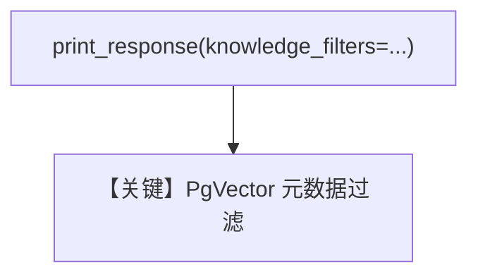

# filtering.py — 实现原理分析

> 源文件：`cookbook/07_knowledge/09_archive/filters/filtering.py`

## 概述

**显式 `knowledge_filters` 字典**：`PgVector` + `PostgresDb` contents，`insert_many` CSV；`Agent(knowledge=..., search_knowledge=True)` **`无显式 model`**，第一次 `print_response` 传入 `knowledge_filters={"region": "north_america", "data_type": "sales"}`。

**核心配置一览：**

| 配置项 | 值 | 说明 |
|--------|------|------|
| `knowledge_filters` | `dict` | 精确键值过滤 |

## System Prompt 组装

默认；无 `instructions`。

## 完整 API 请求

默认 Model 的 `chat.completions`。

## Mermaid 流程图

## 关键源码文件索引

| 文件 | 作用 |
|------|------|
| `agno/knowledge/knowledge.py` | `search` 传 filters |
