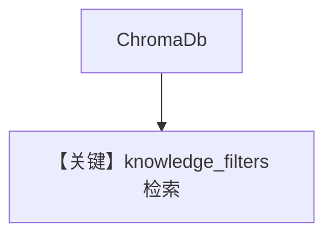

# filtering_chroma_db.py — 实现原理分析

> 源文件：`cookbook/07_knowledge/09_archive/filters/filtering_chroma_db.py`

## 概述

**ChromaDB** 上 `insert_many` PDF CV + metadata，`Agent` + `knowledge_filters`（如按 `user_id`）。持久化路径 `tmp/chromadb`。

## System Prompt 组装

默认 Agent。

## 完整 API 请求

默认 Chat 模型。

## Mermaid 流程图

## 关键源码文件索引

| 文件 | 作用 |
|------|------|
| `agno/vectordb/chroma` | Chroma |
