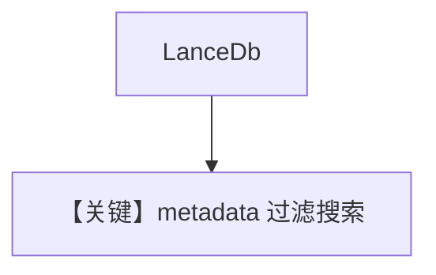

# filtering_lance_db.py — 实现原理分析

> 源文件：`cookbook/07_knowledge/09_archive/filters/filtering_lance_db.py`

## 概述

**LanceDb**（`uri="tmp/lancedb"`）+ `insert_many` CSV metadata；`Agent` + 字典型 `knowledge_filters` 查询。

## System Prompt 组装

默认。

## 完整 API 请求

默认 Chat。

## Mermaid 流程图

## 关键源码文件索引

| 文件 | 作用 |
|------|------|
| `agno/vectordb/lancedb` | Lance |
