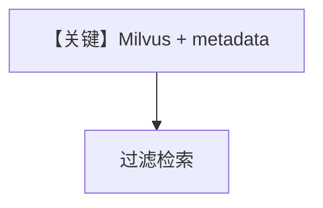

# filtering_milvus.py — 实现原理分析

> 源文件：`cookbook/07_knowledge/09_archive/filters/filtering_milvus.py`

## 概述

**Milvus** 向量库 + `insert_many` 带 metadata；`Agent` + `knowledge_filters` 演示过滤检索。需运行中的 Milvus 与对应 Python 包。

## Mermaid 流程图

## 关键源码文件索引

| 文件 | 作用 |
|------|------|
| `agno/vectordb/milvus` | Milvus |
