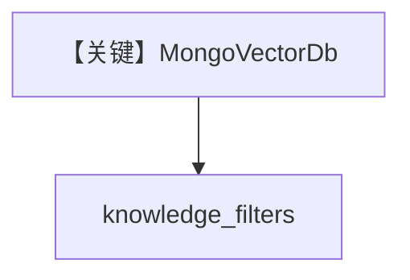

# filtering_mongo_db.py — 实现原理分析

> 源文件：`cookbook/07_knowledge/09_archive/filters/filtering_mongo_db.py`

## 概述

**MongoVectorDb** + 元数据过滤；`insert_many` 后 Agent 带 `knowledge_filters` 查询。

## Mermaid 流程图

## 关键源码文件索引

| 文件 | 作用 |
|------|------|
| `agno/vectordb/mongodb` | Mongo 向量 |
