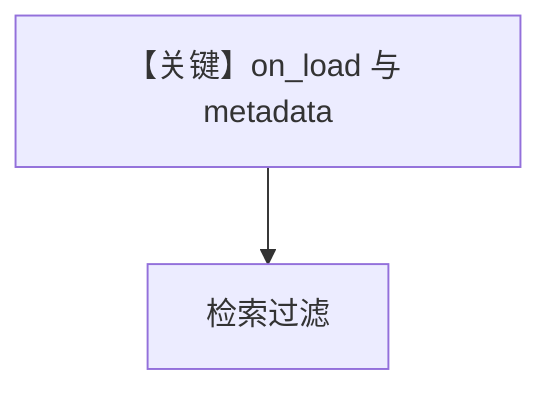

# filtering_on_load.py — 实现原理分析

> 源文件：`cookbook/07_knowledge/09_archive/filters/filtering_on_load.py`

## 概述

演示 **加载阶段/on_load** 与 metadata 过滤的配合（具体钩子以源文件为准），向量后端为 **PgVector**。

## Mermaid 流程图

## 关键源码文件索引

| 文件 | 作用 |
|------|------|
| `agno/knowledge/knowledge.py` | 加载与 insert 流程 |
