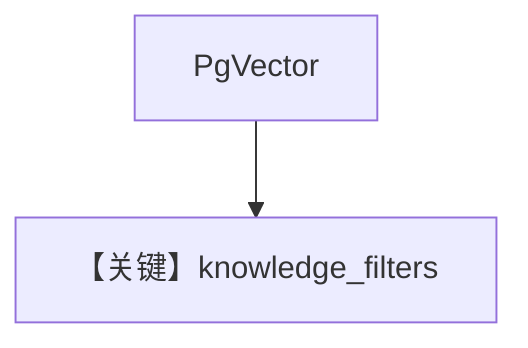

# filtering_pgvector.py — 实现原理分析

> 源文件：`cookbook/07_knowledge/09_archive/filters/filtering_pgvector.py`

## 概述

专聚焦 **PgVector** 表 + `knowledge_filters` 的变体（与同目录 `filtering.py` 可能重复场景，便于按文件名检索）；`insert_many` + Agent。

## Mermaid 流程图

## 关键源码文件索引

| 文件 | 作用 |
|------|------|
| `agno/vectordb/pgvector` | PgVector |
