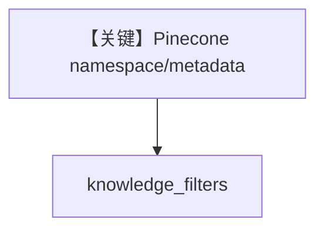

# filtering_pinecone.py — 实现原理分析

> 源文件：`cookbook/07_knowledge/09_archive/filters/filtering_pinecone.py`

## 概述

**PineconeDb** + metadata 过滤；需 `PINECONE_API_KEY` 等环境。`insert_many` 后 Agent 查询。

## Mermaid 流程图

## 关键源码文件索引

| 文件 | 作用 |
|------|------|
| `agno/vectordb/pineconedb` | Pinecone |
