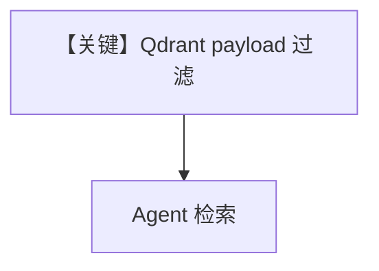

# filtering_qdrant_db.py — 实现原理分析

<!-- cookbook-py-source:start -->
## 完整源码

```python
from agno.agent import Agent
from agno.knowledge.knowledge import Knowledge
from agno.utils.media import (
    SampleDataFileExtension,
    download_knowledge_filters_sample_data,
)
from agno.vectordb.qdrant import Qdrant

# Download all sample CVs and get their paths
downloaded_cv_paths = download_knowledge_filters_sample_data(
    num_files=5, file_extension=SampleDataFileExtension.PDF
)

COLLECTION_NAME = "filtering-cv"

vector_db = Qdrant(collection=COLLECTION_NAME, url="http://localhost:6333")
# Step 1: Initialize knowledge base with documents and metadata
# ------------------------------------------------------------------------------
# When initializing the knowledge base, we can attach metadata that will be used for filtering
# This metadata can include user IDs, document types, dates, or any other attributes

knowledge = Knowledge(
    name="Qdrant Knowledge Base",
    description="A knowledge base for Qdrant",
    vector_db=vector_db,
)

knowledge.insert_many(
    [
        {
            "path": downloaded_cv_paths[0],
            "metadata": {
                "user_id": "jordan_mitchell",
                "document_type": "cv",
                "year": 2025,
            },
        },
        {
            "path": downloaded_cv_paths[1],
            "metadata": {
                "user_id": "taylor_brooks",
                "document_type": "cv",
                "year": 2025,
            },
        },
        {
            "path": downloaded_cv_paths[2],
            "metadata": {
                "user_id": "morgan_lee",
                "document_type": "cv",
                "year": 2025,
            },
        },
        {
            "path": downloaded_cv_paths[3],
            "metadata": {
                "user_id": "casey_jordan",
                "document_type": "cv",
                "year": 2025,
            },
        },
        {
            "path": downloaded_cv_paths[4],
            "metadata": {
                "user_id": "alex_rivera",
                "document_type": "cv",
                "year": 2025,
            },
        },
    ]
)

# Step 2: Query the knowledge base with different filter combinations
# ------------------------------------------------------------------------------

agent = Agent(
    knowledge=knowledge,
    search_knowledge=True,
)

agent.print_response(
    "Tell me about Jordan Mitchell's experience and skills",
    knowledge_filters={"user_id": "jordan_mitchell"},
    markdown=True,
)
```

<!-- cookbook-py-source:end -->

> 源文件：`cookbook/07_knowledge/09_archive/filters/filtering_qdrant_db.py`

## 概述

**Qdrant** 向量库 + payload/metadata 过滤；`insert_many` 与 `knowledge_filters` 联用。

## Mermaid 流程图



## 关键源码文件索引

| 文件 | 作用 |
|------|------|
| `agno/vectordb/qdrant` | Qdrant |
