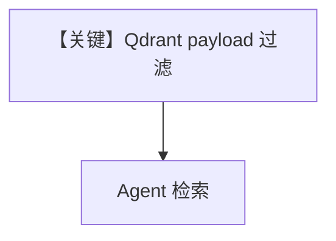

# filtering_qdrant_db.py — 实现原理分析

> 源文件：`cookbook/07_knowledge/09_archive/filters/filtering_qdrant_db.py`

## 概述

**Qdrant** 向量库 + payload/metadata 过滤；`insert_many` 与 `knowledge_filters` 联用。

## Mermaid 流程图

## 关键源码文件索引

| 文件 | 作用 |
|------|------|
| `agno/vectordb/qdrant` | Qdrant |
