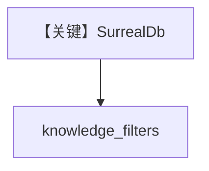

# filtering_surrealdb.py — 实现原理分析

> 源文件：`cookbook/07_knowledge/09_archive/filters/filtering_surrealdb.py`

## 概述

**SurrealDb** 向量适配器 + metadata 过滤；依赖 SurrealDB 服务与驱动。

## Mermaid 流程图

## 关键源码文件索引

| 文件 | 作用 |
|------|------|
| `agno/vectordb/surrealdb` | Surreal |
