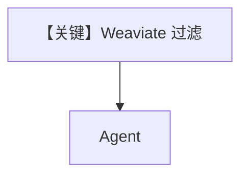

# filtering_weaviate.py — 实现原理分析

> 源文件：`cookbook/07_knowledge/09_archive/filters/filtering_weaviate.py`

## 概述

**Weaviate**（`Distance`/`VectorIndex` 等配置）+ 元数据过滤；`insert_many` 与 Agent 检索。

## Mermaid 流程图

## 关键源码文件索引

| 文件 | 作用 |
|------|------|
| `agno/vectordb/weaviate` | Weaviate |
