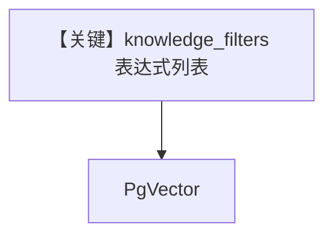

# filtering_with_conditions_on_agent.py — 实现原理分析

> 源文件：`cookbook/07_knowledge/09_archive/filters/filtering_with_conditions_on_agent.py`

## 概述

**过滤器表达式 API**（`IN`/`NOT`/`AND` 等）在 **Agent** 上的用法：`PgVector` + `insert_many`，`print_response(..., knowledge_filters=[...])` 传入 **列表表达式** 而非纯 dict。

## System Prompt 组装

默认 Agent。

## 完整 API 请求

`OpenAIChat`（见文件内 model id）。

## Mermaid 流程图

## 关键源码文件索引

| 文件 | 作用 |
|------|------|
| `agno/filters` | `IN`, `NOT`, `AND` |
