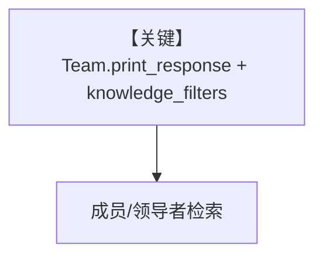

# filtering_with_conditions_on_team.py — 实现原理分析

> 源文件：`cookbook/07_knowledge/09_archive/filters/filtering_with_conditions_on_team.py`

## 概述

**Team** 携带 `knowledge` + **`knowledge_filters`**：`PgVector`，`insert_many` PDF，`web_agent` 为成员，`Team(model=OpenAIChat("o3-mini"), ...)` 上调用 `print_response` 传入过滤器（见文件后半）。

## System Prompt 组装

Team 级 `description`/`instructions` 进入 Team 系统消息路径。

## 完整 API 请求

`OpenAIChat` o3-mini。

## Mermaid 流程图

## 关键源码文件索引

| 文件 | 作用 |
|------|------|
| `agno/team/team.py` | Team 检索 |
