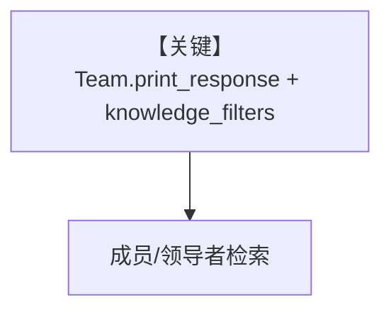

# filtering_with_conditions_on_team.py — 实现原理分析

<!-- cookbook-py-source:start -->
## 完整源码

```python
"""
This example demonstrates how to use knowledge filter expressions with teams.

Knowledge filters allow you to restrict knowledge searches to specific documents
or metadata criteria, enabling personalized and contextual responses.
"""

from agno.agent import Agent
from agno.filters import AND, IN, NOT
from agno.knowledge.knowledge import Knowledge
from agno.knowledge.reader.pdf_reader import PDFReader
from agno.models.openai import OpenAIChat
from agno.team.team import Team
from agno.utils.media import (
    SampleDataFileExtension,
    download_knowledge_filters_sample_data,
)
from agno.vectordb.pgvector import PgVector

# Download all sample CVs and get their paths
downloaded_cv_paths = download_knowledge_filters_sample_data(
    num_files=5, file_extension=SampleDataFileExtension.PDF
)

# Initialize PGVector
vector_db = PgVector(
    table_name="recipes",
    db_url="postgresql+psycopg://ai:ai@localhost:5532/ai",
)

# Create knowledge base
knowledge_base = Knowledge(
    vector_db=vector_db,
)

# Add documents with metadata for filtering
knowledge_base.insert_many(
    [
        {
            "path": downloaded_cv_paths[0],
            "metadata": {
                "user_id": "jordan_mitchell",
                "document_type": "cv",
                "year": 2025,
            },
        },
        {
            "path": downloaded_cv_paths[1],
            "metadata": {
                "user_id": "taylor_brooks",
                "document_type": "cv",
                "year": 2025,
            },
        },
        {
            "path": downloaded_cv_paths[2],
            "metadata": {
                "user_id": "morgan_lee",
                "document_type": "cv",
                "year": 2025,
            },
        },
        {
            "path": downloaded_cv_paths[3],
            "metadata": {
                "user_id": "casey_jordan",
                "document_type": "cv",
                "year": 2020,
            },
        },
        {
            "path": downloaded_cv_paths[4],
            "metadata": {
                "user_id": "alex_rivera",
                "document_type": "cv",
                "year": 2020,
            },
        },
    ],
    reader=PDFReader(chunk=True),
)

# Create knowledge search agent
web_agent = Agent(
    name="Knowledge Search Agent",
    role="Handle knowledge search",
    knowledge=knowledge_base,
    model=OpenAIChat(id="o3-mini"),
)

# Create team with knowledge filters
team_with_knowledge = Team(
    name="Team with Knowledge",
    instructions=["Always search the knowledge base for the most relevant information"],
    description="A team that provides information about candidates",
    members=[
        web_agent
    ],  # If you omit the member, the leader will search the knowledge base itself.
    model=OpenAIChat(id="o3-mini"),
    knowledge=knowledge_base,
    show_members_responses=True,
    markdown=True,
)

print("--------------------------------")
print("Using IN operator")
team_with_knowledge.print_response(
    "Tell me about the candidate's work and experience",
    knowledge_filters=[
        (
            IN(
                "user_id",
                [
                    "jordan_mitchell",
                    "taylor_brooks",
                    "morgan_lee",
                    "casey_jordan",
                    "alex_rivera",
                ],
            )
        )
    ],
    markdown=True,
)

print("--------------------------------")
print("Using NOT operator")
team_with_knowledge.print_response(
    "Tell me about the candidate's work and experience",
    knowledge_filters=[
        AND(
            IN("user_id", ["jordan_mitchell", "taylor_brooks"]),
            NOT(IN("user_id", ["morgan_lee", "casey_jordan", "alex_rivera"])),
        )
    ],
    markdown=True,
)
```

<!-- cookbook-py-source:end -->

> 源文件：`cookbook/07_knowledge/09_archive/filters/filtering_with_conditions_on_team.py`

## 概述

**Team** 携带 `knowledge` + **`knowledge_filters`**：`PgVector`，`insert_many` PDF，`web_agent` 为成员，`Team(model=OpenAIChat("o3-mini"), ...)` 上调用 `print_response` 传入过滤器（见文件后半）。

## System Prompt 组装

Team 级 `description`/`instructions` 进入 Team 系统消息路径。

## 完整 API 请求

`OpenAIChat` o3-mini。

## Mermaid 流程图



## 关键源码文件索引

| 文件 | 作用 |
|------|------|
| `agno/team/team.py` | Team 检索 |
