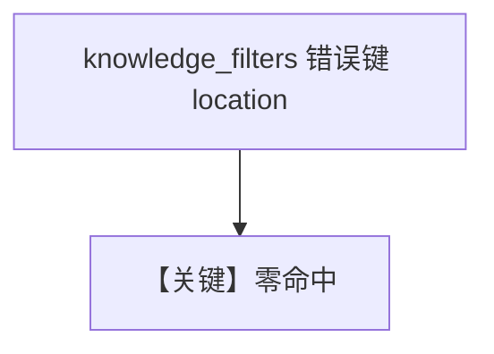

# filtering_with_invalid_keys.py — 实现原理分析

<!-- cookbook-py-source:start -->
## 完整源码

```python
from agno.agent import Agent
from agno.knowledge.knowledge import Knowledge
from agno.utils.media import (
    SampleDataFileExtension,
    download_knowledge_filters_sample_data,
)
from agno.vectordb.lancedb import LanceDb

# Download all sample sales documents and get their paths
downloaded_csv_paths = download_knowledge_filters_sample_data(
    num_files=4, file_extension=SampleDataFileExtension.CSV
)

# Initialize LanceDB
# By default, it stores data in /tmp/lancedb
vector_db = LanceDb(
    table_name="recipes",
    uri="tmp/lancedb",  # You can change this path to store data elsewhere
)

# Step 1: Initialize knowledge with documents and metadata
# -----------------------------------------------------------------------------
knowledge = Knowledge(
    name="CSV Knowledge Base",
    description="A knowledge base for CSV files",
    vector_db=vector_db,
)

# Load all documents into the vector database
knowledge.insert_many(
    [
        {
            "path": downloaded_csv_paths[0],
            "metadata": {
                "data_type": "sales",
                "quarter": "Q1",
                "year": 2024,
                "region": "north_america",
                "currency": "USD",
            },
        },
        {
            "path": downloaded_csv_paths[1],
            "metadata": {
                "data_type": "sales",
                "year": 2024,
                "region": "europe",
                "currency": "EUR",
            },
        },
        {
            "path": downloaded_csv_paths[2],
            "metadata": {
                "data_type": "survey",
                "survey_type": "customer_satisfaction",
                "year": 2024,
                "target_demographic": "mixed",
            },
        },
        {
            "path": downloaded_csv_paths[3],
            "metadata": {
                "data_type": "financial",
                "sector": "technology",
                "year": 2024,
                "report_type": "quarterly_earnings",
            },
        },
    ],
)

# Step 2: Query the knowledge base with incorrect filter keys
# ------------------------------------------------------------------------------
na_sales = Agent(
    knowledge=knowledge,
    search_knowledge=True,
)

na_sales.print_response(
    "Revenue performance and top selling products",
    # Use "location" instead of "region" and we won't receive any content because the key is invalid
    knowledge_filters={"location": "north_america", "data_type": "sales"},
    markdown=True,
)
```

<!-- cookbook-py-source:end -->

> 源文件：`cookbook/07_knowledge/09_archive/filters/filtering_with_invalid_keys.py`

## 概述

**错误 metadata 键**：`LanceDb` + `insert_many`，`print_response` 使用 `knowledge_filters={"location": "north_america", ...}` 而真实键为 **`region`**，演示 **无命中/空内容** 行为。

## 运行机制与因果链

过滤键与入库 metadata 不一致时，检索结果为空；用于教调试 **键名对齐**。

## Mermaid 流程图



## 关键源码文件索引

| 文件 | 作用 |
|------|------|
| `agno/vectordb/lancedb` | Lance |
