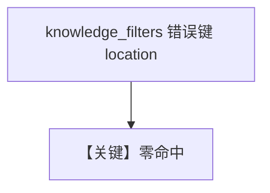

# filtering_with_invalid_keys.py — 实现原理分析

> 源文件：`cookbook/07_knowledge/09_archive/filters/filtering_with_invalid_keys.py`

## 概述

**错误 metadata 键**：`LanceDb` + `insert_many`，`print_response` 使用 `knowledge_filters={"location": "north_america", ...}` 而真实键为 **`region`**，演示 **无命中/空内容** 行为。

## 运行机制与因果链

过滤键与入库 metadata 不一致时，检索结果为空；用于教调试 **键名对齐**。

## Mermaid 流程图

## 关键源码文件索引

| 文件 | 作用 |
|------|------|
| `agno/vectordb/lancedb` | Lance |
