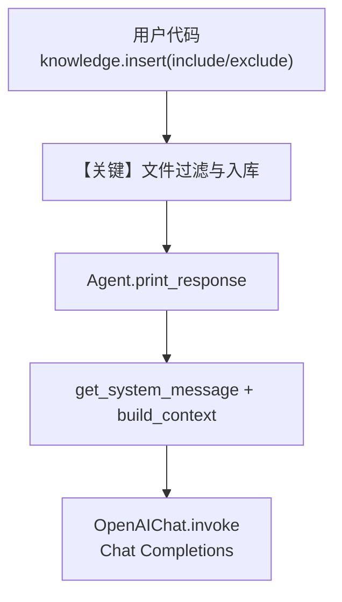

# include_exclude_files.py — 实现原理分析

<!-- cookbook-py-source:start -->
## 完整源码

```python
"""
Include And Exclude Files
=========================

Demonstrates include and exclude filters when loading directory content into knowledge.
"""

import asyncio

from agno.agent import Agent
from agno.knowledge.knowledge import Knowledge
from agno.vectordb.pgvector import PgVector

# ---------------------------------------------------------------------------
# Setup
# ---------------------------------------------------------------------------
vector_db = PgVector(
    table_name="vectors", db_url="postgresql+psycopg://ai:ai@localhost:5532/ai"
)


# ---------------------------------------------------------------------------
# Create Knowledge Base
# ---------------------------------------------------------------------------
def create_knowledge() -> Knowledge:
    return Knowledge(
        name="Basic SDK Knowledge Base",
        description="Agno 2.0 Knowledge Implementation",
        vector_db=vector_db,
    )


# ---------------------------------------------------------------------------
# Create Agent
# ---------------------------------------------------------------------------
def create_agent(knowledge: Knowledge) -> Agent:
    return Agent(
        name="My Agent",
        description="Agno 2.0 Agent Implementation",
        knowledge=knowledge,
        search_knowledge=True,
        debug_mode=True,
    )


# ---------------------------------------------------------------------------
# Run Agent
# ---------------------------------------------------------------------------
def run_sync() -> None:
    knowledge = create_knowledge()
    knowledge.insert(
        name="CV",
        path="cookbook/07_knowledge/testing_resources",
        metadata={"user_tag": "Engineering Candidates"},
        include=["*.pdf"],
        exclude=["*cv_5*"],
    )

    agent = create_agent(knowledge)
    agent.print_response(
        "Who is the best candidate for the role of a software engineer?",
        markdown=True,
    )
    agent.print_response(
        "Do you think Alex Rivera is a good candidate?",
        markdown=True,
    )


async def run_async() -> None:
    knowledge = create_knowledge()
    await knowledge.ainsert(
        name="CV",
        path="cookbook/07_knowledge/testing_resources",
        metadata={"user_tag": "Engineering Candidates"},
        include=["*.pdf"],
        exclude=["*cv_5*"],
    )

    agent = create_agent(knowledge)
    agent.print_response(
        "Who is the best candidate for the role of a software engineer?",
        markdown=True,
    )
    agent.print_response(
        "Do you think Alex Rivera is a good candidate?",
        markdown=True,
    )


if __name__ == "__main__":
    run_sync()
    asyncio.run(run_async())
```

<!-- cookbook-py-source:end -->

> 源文件：`cookbook/07_knowledge/09_archive/filters/include_exclude_files.py`

## 概述

本示例展示 Agno 在 **目录入库** 时通过 **`include` / `exclude` 通配符** 过滤文件：只把匹配的源文件读入向量库，再让 Agent 用 `search_knowledge_base` 检索回答。

**核心配置一览：**

| 配置项 | 值 | 说明 |
|--------|-----|------|
| `Knowledge.name` | `"Basic SDK Knowledge Base"` | 知识库名称 |
| `Knowledge.description` | `"Agno 2.0 Knowledge Implementation"` | 知识库描述 |
| `vector_db` | `PgVector(table_name="vectors", db_url=...)` | PostgreSQL + pgvector |
| `Agent.name` | `"My Agent"` | Agent 名称 |
| `Agent.description` | `"Agno 2.0 Agent Implementation"` | 参与默认 system 拼装 |
| `knowledge` | 上述 `Knowledge` | 启用 RAG |
| `search_knowledge` | `True` | 注册检索工具并参与运行 |
| `debug_mode` | `True` | 调试日志 |
| `insert(..., include, exclude)` | `["*.pdf"]`, `["*cv_5*"]` | 目录扫描过滤 |
| `model` | `None`（运行时由 `_init.set_default_model` 设为 `OpenAIChat(id="gpt-4o")`） | Chat Completions |
| `instructions` | 未显式设置 | 未设置 |
| `markdown`（`print_response`） | `True` | 用户侧要求 Markdown 输出 |

## 架构分层

```
用户代码层                agno.agent 层
┌────────────────────────┐    ┌──────────────────────────────────────┐
│ include_exclude_files  │    │ Agent._run() / print_response()      │
│ knowledge.insert(      │───>│ get_system_message()（_messages.py） │
│   include/exclude)     │    │  ├ description / instructions       │
│ Agent(..., knowledge)  │    │  ├ #3.3.13: Knowledge.build_context  │
└────────────────────────┘    │ get_run_messages() → 用户消息        │
                                └──────────────────┬─────────────────┘
                                                   ▼
                                        ┌─────────────────────┐
                                        │ OpenAIChat          │
                                        │ chat.completions    │
                                        │ (默认 gpt-4o)       │
                                        └─────────────────────┘
```

## 核心组件解析

### Knowledge.insert 与路径过滤

`insert` 在解析 `path` 为目录时，会结合 `include` / `exclude` 决定哪些文件进入读取与向量化管线；不匹配的文件不会入库。

### Agent 与 search_knowledge

`search_knowledge=True` 时，Agent 会挂载 `search_knowledge_base` 工具；配合 `Knowledge.build_context()` 注入的说明，模型被约束为「先检索再回答」。

### 运行机制与因果链

1. **数据路径**：本地目录 → 过滤后的文件 → 分块与嵌入 → `PgVector` → Agent 收到用户问题 → `search_knowledge` 工具检索 → 模型综合工具结果作答。
2. **状态与副作用**：写入 PostgreSQL 向量表与内容记录（若配置）；重复运行同一目录可能重复插入，除非使用 `skip_if_exists` 等机制（本示例未演示）。
3. **关键分支**：`include` 仅 `*.pdf` 时非 PDF 被排除；`exclude` 含 `*cv_5*` 时匹配该模式的文件被排除。
4. **与相邻示例差异**：本文件聚焦 **文件级 include/exclude**，而非 `isolate_vector_search` 或 FilterExpr。

## System Prompt 组装

| 序号 | 组成部分 | 本文件中的值/来源 | 是否生效 |
|------|-----------|-------------------|----------|
| 1 | `description` | `"Agno 2.0 Agent Implementation"` | 是（#3.3.1） |
| 2 | `role` | 未设置 | 否 |
| 3 | `instructions` | 未设置 | 否 |
| 4 | `markdown`（Agent 构造参数） | 未设置（默认 `False`） | 否 |
| 5 | `#3.3.13` `Knowledge.build_context` | `Knowledge._SEARCH_KNOWLEDGE_INSTRUCTIONS` 包在 `<knowledge_base>` 中 | 是（`add_search_knowledge_instructions` 默认 `True`） |

### 拼装顺序与源码锚点

1. `#3.3.1` `agent.description`（`agno/agent/_messages.py`）
2. `#3.3.3` `instructions`（空）
3. 中间各可选段（memory、session summary 等，本示例未启用）
4. `#3.3.13`：`get_system_message()` 在 L409-L418 附近调用 `Knowledge.build_context()` 追加 `<knowledge_base>...</knowledge_base>`
5. `#3.3.14`：`model.get_system_message_for_model(tools)`

### 还原后的完整 System 文本

```text
Agno 2.0 Agent Implementation

<knowledge_base>
You have a knowledge base you can search using the search_knowledge_base tool. Search before answering questions—don't assume you know the answer. For ambiguous questions, search first rather than asking for clarification.
</knowledge_base>
```

（若运行时启用了其他 Agent 可选能力，实际字符串会更长；上式为仅含本文件显式配置时的最小 faithful 还原。）

### 段落释义（模型视角）

- **description**：给模型一个高层身份/场景说明（本例为泛化实现描述）。
- **knowledge_base 段**：明确要求使用 `search_knowledge_base`，避免闭卷臆答。

### 与 User 消息的边界

用户问题来自 `print_response` 的第一个参数；检索由工具调用完成，用户消息不包含向量内容。

## 完整 API 请求

`OpenAIChat` 使用 **Chat Completions**（`libs/agno/agno/models/openai/chat.py` 的 `invoke`）。默认 `role_map` 将 `system` 映射为 `developer`（`default_role_map` L94-L100）。

```python
# 概念上等价的一次 chat.completions.create（字段随运行时 tools/stream 变化）
client.chat.completions.create(
    model="gpt-4o",  # set_default_model 默认
    messages=[
        {"role": "developer", "content": "<见上一节还原的 system 文本>"},
        {"role": "user", "content": "Who is the best candidate for the role of a software engineer?"},
    ],
    tools=[...],  # 含 search_knowledge_base
)
```

## Mermaid 流程图



- **【关键】文件过滤与入库**：决定哪些 PDF 进入向量库，是后续检索能否命中 `cv_5` 等的前提。

## 关键源码文件索引

| 文件 | 关键函数/类 | 作用 |
|------|-------------|------|
| `agno/agent/_messages.py` | `get_system_message()` L106-L450 | 默认 system 拼装，含 #3.3.13 |
| `agno/knowledge/knowledge.py` | `build_context()` L2908+ | 注入 `<knowledge_base>` 说明 |
| `agno/agent/_init.py` | `set_default_model()` L66+ | 无 model 时默认 `OpenAIChat(id="gpt-4o")` |
| `agno/models/openai/chat.py` | `OpenAIChat` | Chat Completions API |
