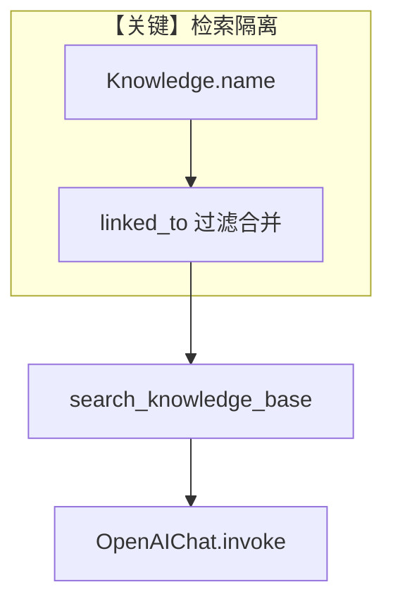

# isolate_vector_search.py — 实现原理分析

<!-- cookbook-py-source:start -->
## 完整源码

```python
"""Demonstrates knowledge isolation with isolate_vector_search flag.

When multiple Knowledge instances share the same vector database, you can use
the `isolate_vector_search` flag to ensure each instance only searches its own data.

Behavior:
- isolate_vector_search=False (default): Searches ALL vectors in the database.
  This is backwards-compatible with existing data that doesn't have linked_to metadata.

- isolate_vector_search=True: Only searches vectors that have matching linked_to metadata.
  Documents inserted with this flag will have linked_to set to the Knowledge instance name.
  Searches will filter to only return documents with matching linked_to.

IMPORTANT: If you have existing production data and want to enable isolation, you will
need to re-index your data with isolate_vector_search=True to add the linked_to metadata.
Existing documents without linked_to metadata will NOT be found when isolation is enabled.

Run: `python cookbook/07_knowledge/basic_operations/async/05_isolate_vector_search.py`
"""

import asyncio

from agno.agent import Agent
from agno.db.postgres.postgres import PostgresDb
from agno.knowledge.knowledge import Knowledge
from agno.vectordb.pgvector import PgVector

# Shared database connections
contents_db = PostgresDb(
    db_url="postgresql+psycopg://ai:ai@localhost:5532/ai",
    knowledge_table="knowledge_contents",
)

vector_db = PgVector(
    table_name="vectors",
    db_url="postgresql+psycopg://ai:ai@localhost:5532/ai",
)

# -----------------------------------------------------------------------------
# Example 1: Default behavior (isolate_vector_search=False)
# Searches across ALL vectors in the database, regardless of which Knowledge
# instance inserted them. This is the default for backwards compatibility.
# -----------------------------------------------------------------------------

knowledge_shared = Knowledge(
    name="Shared Knowledge",
    description="This knowledge instance searches all vectors",
    vector_db=vector_db,
    contents_db=contents_db,
    # isolate_vector_search=False is the default
)

# -----------------------------------------------------------------------------
# Example 2: Isolated behavior (isolate_vector_search=True)
# Only searches vectors that were inserted by this Knowledge instance.
# Documents are tagged with linked_to metadata during insert.
# -----------------------------------------------------------------------------

knowledge_isolated = Knowledge(
    name="Isolated Knowledge",
    description="This knowledge instance only searches its own vectors",
    vector_db=vector_db,
    contents_db=contents_db,
    isolate_vector_search=True,  # Enable isolation
)


async def main():
    # Insert a document with isolation enabled
    # This document will have linked_to="Isolated Knowledge" in its metadata
    await knowledge_isolated.ainsert(
        name="CV",
        path="cookbook/07_knowledge/testing_resources/cv_1.pdf",
        metadata={"user_tag": "Engineering Candidates"},
    )

    # Agent using isolated knowledge - only finds documents from this instance
    agent_isolated = Agent(
        name="Isolated Agent",
        knowledge=knowledge_isolated,
        search_knowledge=True,
        debug_mode=True,
    )

    print("--- Agent with isolate_vector_search=True ---")
    print("Only searches vectors with linked_to='Isolated Knowledge'")
    agent_isolated.print_response(
        "What skills does Jordan Mitchell have?",
        markdown=True,
    )

    # Agent using shared knowledge - finds ALL documents in the vector db
    agent_shared = Agent(
        name="Shared Agent",
        knowledge=knowledge_shared,
        search_knowledge=True,
        debug_mode=True,
    )

    print("--- Agent with isolate_vector_search=False (default) ---")
    print("Searches all vectors in the database")
    agent_shared.print_response(
        "What skills does Jordan Mitchell have?",
        markdown=True,
    )


if __name__ == "__main__":
    asyncio.run(main())
```

<!-- cookbook-py-source:end -->

> 源文件：`cookbook/07_knowledge/09_archive/filters/isolate_vector_search.py`

## 概述

本示例展示 **`isolate_vector_search`**：多实例共享同一 `PgVector` 表时，是否在检索阶段自动注入 **`linked_to` 元数据过滤**，从而只搜本 `Knowledge` 实例写入的向量。

**核心配置一览：**

| 配置项 | 值 | 说明 |
|--------|-----|------|
| `Knowledge(..., isolate_vector_search)` | `False` / `True` 两例对比 | 控制隔离 |
| `contents_db` | `PostgresDb(knowledge_table="knowledge_contents")` | 内容侧存储 |
| `vector_db` | `PgVector(table_name="vectors", ...)` | 共享向量表 |
| `Agent` ×2 | `knowledge_isolated` / `knowledge_shared` | 对比检索范围 |
| `search_knowledge` | `True` | 启用检索工具 |
| `debug_mode` | `True` | 调试 |
| `model` | `None` → 默认 `OpenAIChat(id="gpt-4o")` | Chat Completions |

## 架构分层

```
用户代码层                     agno.knowledge + vectordb
┌─────────────────────┐        ┌────────────────────────────────────┐
│ 两个 Knowledge      │        │ insert: 可为文档打 linked_to      │
│ 同一 PgVector       │───────>│ search: isolate 时合并 linked_to │
└─────────────────────┘        └──────────────────┬─────────────────┘
                                                  ▼
                                        Agent + search_knowledge_base
```

## 核心组件解析

### `isolate_vector_search` 与 `linked_to`

在 `Knowledge` 检索路径中，当 `isolate_vector_search=True` 且 `name` 非空时，框架会把 `linked_to` 并入过滤条件（参见 `agno/knowledge/knowledge.py` 约 L531-L579 附近注释与逻辑），使搜索结果只包含该实例写入的文档。

### 运行机制与因果链

1. **路径**：`ainsert` → 向量与元数据写入 → Agent 提问 → `search_knowledge_base` → 向量库 search 带隔离过滤（若开启）。
2. **副作用**：写入 Postgres 向量表与 contents；生产数据从无 `linked_to` 迁到隔离需 **重新索引**（文件头注释已说明）。
3. **分支**：`isolate_vector_search=False` 时不过滤 `linked_to`，可搜到表内全部向量。
4. **定位**：与「FilterExpr 用户过滤」示例互补；本文件只演示 **实例级隔离标志**。

## System Prompt 组装

两枚 Agent 均未设置 `instructions`，默认 system 由 `description` 缺失（未设）、`#3.3.13` knowledge 块等构成。本示例 **未** 设置 `Agent.description`。

| 组成部分 | 状态 | 是否生效 |
|-----------|------|----------|
| `description` | 未设置 | 否 |
| `#3.3.13` `<knowledge_base>` | `build_context()` | 是 |

### 还原后的完整 System 文本

```text
<knowledge_base>
You have a knowledge base you can search using the search_knowledge_base tool. Search before answering questions—don't assume you know the answer. For ambiguous questions, search first rather than asking for clarification.
</knowledge_base>
```

### 段落释义

- 强调 **必须先搜索**，与隔离检索配合：隔离改变「搜到谁的数据」，不改变「要先搜」的策略。

### 与 User 消息边界

用户问题例如「What skills does Jordan Mitchell have?」；具体命中哪条向量由 **隔离过滤 + 查询** 共同决定。

## 完整 API 请求

默认模型 `gpt-4o`，`OpenAIChat` → `chat.completions.create`，`system` 角色在客户端常映射为 `developer`。

## Mermaid 流程图



## 关键源码文件索引

| 文件 | 关键位置 | 作用 |
|------|----------|------|
| `agno/knowledge/knowledge.py` | `isolate_vector_search`、search 过滤 L531+ | 隔离语义 |
| `agno/agent/_messages.py` | `#3.3.13` L409+ | knowledge 段注入 |
