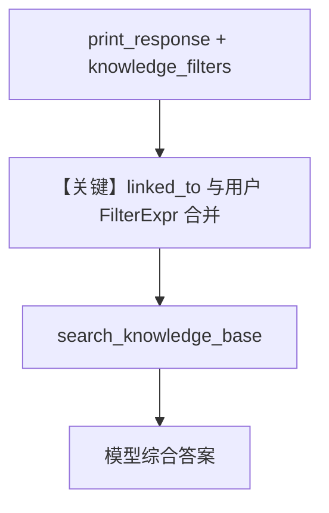

# isolate_with_filter_expressions.py — 实现原理分析

> 源文件：`cookbook/07_knowledge/09_archive/filters/isolate_with_filter_expressions.py`

## 概述

本示例展示 **`isolate_vector_search=True`** 与 **`knowledge_filters`（FilterExpr 列表）** 同时生效：框架自动注入 **`linked_to` 与业务侧 `EQ`/`IN`/`AND`/`NOT` 组合**，实现「实例隔离 + 元数据过滤」。

**核心配置一览：**

| 配置项 | 值 | 说明 |
|--------|-----|------|
| `sales_knowledge` / `survey_knowledge` | `isolate_vector_search=True` | 各实例独立 |
| `vector_db` | 共享 `PgVector(table_name="isolated_filter_demo")` | 同表 |
| `Agent` | `knowledge=...`, `search_knowledge=True` | 未设 `name`/`model`（默认 gpt-4o） |
| `print_response(..., knowledge_filters=[...])` | `EQ`/`IN`/`AND`+`NOT` | 运行期过滤 |

## 架构分层

```
用户代码层                    agno 内部
┌──────────────────┐         ┌─────────────────────────────────────┐
│ insert_many 元数据│────────>│ 向量 + metadata 入库               │
│ Agent.print_response      │ │ search: linked_to AND 用户 FilterExpr│
│   knowledge_filters       │ └─────────────────────────────────────┘
└──────────────────┘
```

## 核心组件解析

### FilterExpr 与隔离

`agno.filters` 中的 `EQ`、`IN`、`AND`、`NOT` 用于表达结构化过滤；在 `isolate_vector_search` 下，搜索前会将 **`linked_to` 与表达式列表** 合并（参见 `knowledge.py` 检索路径）。

### 运行机制与因果链

1. **路径**：CSV 样本下载 → 两个 Knowledge 分别 `insert_many` → Agent 提问 → 工具检索（带双重过滤）。
2. **副作用**：写入向量库；多次运行可能重复数据，需注意清理或 `skip_if_exists`（未演示）。
3. **分支**：仅 `EQ(region, north_america)` 与再加 `NOT(EQ(region,europe))` 时命中集合不同。
4. **差异**：比纯 `isolate_vector_search` 多演示 **列表型 FilterExpr API**。

## System Prompt 组装

未设置 `description`/`instructions`；默认仅有 `#3.3.13` knowledge 块（及模型侧附加，若有）。

### 还原后的完整 System 文本

```text
<knowledge_base>
You have a knowledge base you can search using the search_knowledge_base tool. Search before answering questions—don't assume you know the answer. For ambiguous questions, search first rather than asking for clarification.
</knowledge_base>
```

## 完整 API 请求

`OpenAIChat`（默认）→ Chat Completions；`knowledge_filters` 影响工具内部检索参数，不直接出现在 HTTP `messages` 里。

## Mermaid 流程图



## 关键源码文件索引

| 文件 | 作用 |
|------|------|
| `agno/knowledge/knowledge.py` | 隔离与 filters 合并 |
| `agno/filters/__init__.py` | `EQ`/`IN`/`AND`/`NOT` |
| `agno/agent/_messages.py` | `get_system_message` #3.3.13 |
