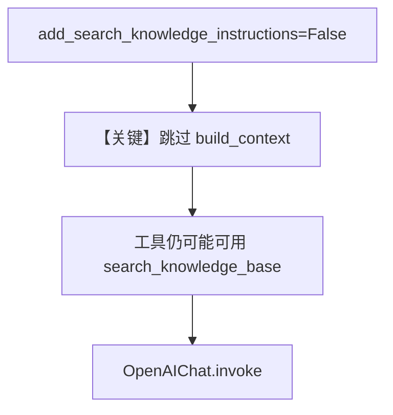

# knowledge_instructions.py — 实现原理分析

<!-- cookbook-py-source:start -->
## 完整源码

```python
"""
Knowledge Instructions
======================

Demonstrates disabling automatic search-knowledge instructions on an agent.
"""

from agno.agent import Agent
from agno.db.postgres.postgres import PostgresDb
from agno.knowledge.knowledge import Knowledge
from agno.vectordb.pgvector import PgVector

# ---------------------------------------------------------------------------
# Setup
# ---------------------------------------------------------------------------
contents_db = PostgresDb(
    db_url="postgresql+psycopg://ai:ai@localhost:5532/ai",
    knowledge_table="knowledge_contents",
)
vector_db = PgVector(
    table_name="vectors", db_url="postgresql+psycopg://ai:ai@localhost:5532/ai"
)

# ---------------------------------------------------------------------------
# Create Knowledge Base
# ---------------------------------------------------------------------------
knowledge = Knowledge(
    name="Basic SDK Knowledge Base",
    description="Agno 2.0 Knowledge Implementation",
    contents_db=contents_db,
    vector_db=vector_db,
)

# ---------------------------------------------------------------------------
# Create Agent
# ---------------------------------------------------------------------------
agent = Agent(
    name="My Agent",
    description="Agno 2.0 Agent Implementation",
    knowledge=knowledge,
    search_knowledge=True,
    add_search_knowledge_instructions=False,
)


# ---------------------------------------------------------------------------
# Run Agent
# ---------------------------------------------------------------------------
def main() -> None:
    knowledge.insert(
        name="Recipes",
        url="https://agno-public.s3.amazonaws.com/recipes/ThaiRecipes.pdf",
        metadata={"user_tag": "Recipes from website"},
    )
    agent.print_response("What can you tell me about Thai recipes?")


if __name__ == "__main__":
    main()
```

<!-- cookbook-py-source:end -->

> 源文件：`cookbook/07_knowledge/09_archive/filters/knowledge_instructions.py`

## 概述

本示例展示 **`add_search_knowledge_instructions=False`**：在仍启用 `search_knowledge=True`（工具仍可用）的前提下，**不向 system prompt 注入** `Knowledge.build_context()` 生成的「先搜索」说明段落。

**核心配置一览：**

| 配置项 | 值 | 说明 |
|--------|-----|------|
| `knowledge` | `Knowledge` + `contents_db` + `PgVector` | 标准 RAG |
| `search_knowledge` | `True` | 仍注册检索工具 |
| `add_search_knowledge_instructions` | `False` | 关闭 #3.3.13 知识说明段 |
| `name` / `description` | Agent 侧均有 | 参与默认 system |
| `model` | 默认 `OpenAIChat(id="gpt-4o")` | Chat Completions |

## 架构分层

```
Agent 构造参数 add_search_knowledge_instructions=False
        │
        ▼
get_system_message() #3.3.13 条件不满足 → 不追加 <knowledge_base> 段
        │
        ▼
search_knowledge_base 工具仍随 Knowledge.get_tools() 可用
```

## 核心组件解析

### `#3.3.13` 条件分支

```409:418:libs/agno/agno/agent/_messages.py
    # 3.3.13 then add search_knowledge instructions to the system prompt
    _resolved_knowledge = _get_resolved_knowledge(agent, run_context)
    if _resolved_knowledge is not None and agent.search_knowledge and agent.add_search_knowledge_instructions:
        build_context_fn = getattr(_resolved_knowledge, "build_context", None)
        if callable(build_context_fn):
            knowledge_context = build_context_fn(
                enable_agentic_filters=agent.enable_agentic_knowledge_filters,
            )
            if knowledge_context is not None:
                system_message_content += knowledge_context + "\n"
```

当 `add_search_knowledge_instructions=False` 时，**不**执行 `build_context()`，system 中无 `<knowledge_base>...</knowledge_base>` 教学段。

### 运行机制与因果链

1. **路径**：用户仍可通过工具定义使用 `search_knowledge_base`，但模型未在 system 中被明确要求「先搜」。
2. **副作用**：与常规 RAG 相同（入库写 DB）。
3. **分支**：与默认 `True` 相比，**仅 system 文本不同**，工具集合一致（视实现版本请以当前代码为准）。
4. **差异**：适合已在 **`instructions`** 里自定义检索策略、或想减少 prompt 长度的场景。

## System Prompt 组装

| 组成部分 | 生效 |
|-----------|------|
| `description` | `"Agno 2.0 Agent Implementation"` |
| `#3.3.13` | **否**（因 `add_search_knowledge_instructions=False`） |

### 还原后的完整 System 文本

```text
Agno 2.0 Agent Implementation
```

（无 `<knowledge_base>` 段；若未设置 `instructions` 且仅有 `description`，如上。）

## 完整 API 请求

Chat Completions；`messages[0]` 为 `developer` 角色内容，仅含 description，无 knowledge 块。

## Mermaid 流程图



## 关键源码文件索引

| 文件 | 位置 | 作用 |
|------|------|------|
| `agno/agent/agent.py` | `add_search_knowledge_instructions` 默认 `True` L197-199 | Agent 字段 |
| `agno/agent/_messages.py` | L409-418 | 条件注入 knowledge 段 |
