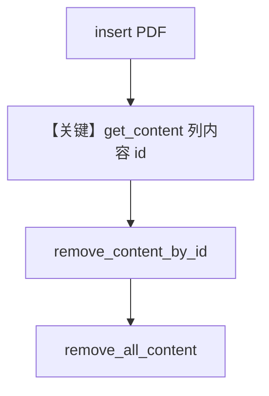

# remove_content.py — 实现原理分析

<!-- cookbook-py-source:start -->
## 完整源码

```python
"""
Remove Content
==============

Demonstrates removing knowledge content by id and clearing all content, with sync and async APIs.
"""

import asyncio

from agno.db.postgres.postgres import PostgresDb
from agno.knowledge.knowledge import Knowledge
from agno.vectordb.pgvector import PgVector

# ---------------------------------------------------------------------------
# Setup
# ---------------------------------------------------------------------------
vector_db = PgVector(
    table_name="vectors", db_url="postgresql+psycopg://ai:ai@localhost:5532/ai"
)
contents_db = PostgresDb(
    db_url="postgresql+psycopg://ai:ai@localhost:5532/ai",
    knowledge_table="knowledge_contents",
)


# ---------------------------------------------------------------------------
# Create Knowledge Base
# ---------------------------------------------------------------------------
def create_knowledge() -> Knowledge:
    return Knowledge(
        name="Basic SDK Knowledge Base",
        description="Agno 2.0 Knowledge Implementation",
        contents_db=contents_db,
        vector_db=vector_db,
    )


# ---------------------------------------------------------------------------
# Run Agent
# ---------------------------------------------------------------------------
def run_sync() -> None:
    knowledge = create_knowledge()
    knowledge.insert(
        name="CV",
        path="cookbook/07_knowledge/testing_resources/cv_1.pdf",
        metadata={"user_tag": "Engineering Candidates"},
    )

    contents, _ = knowledge.get_content()
    for content in contents:
        print(content.id)
        print(" ")
        knowledge.remove_content_by_id(content.id)

    knowledge.remove_all_content()


async def run_async() -> None:
    knowledge = create_knowledge()
    await knowledge.ainsert(
        name="CV",
        path="cookbook/07_knowledge/testing_resources/cv_1.pdf",
        metadata={"user_tag": "Engineering Candidates"},
    )

    contents, _ = await knowledge.aget_content()
    for content in contents:
        print(content.id)
        print(" ")
        await knowledge.aremove_content_by_id(content.id)

    await knowledge.aremove_all_content()


if __name__ == "__main__":
    run_sync()
    asyncio.run(run_async())
```

<!-- cookbook-py-source:end -->

> 源文件：`cookbook/07_knowledge/09_archive/lifecycle/remove_content.py`

## 概述

本示例聚焦 **内容库（contents）侧删除**：`get_content` / `remove_content_by_id` / `remove_all_content` 及异步对应，演示在 **无 Agent、无 LLM 调用** 下管理 `Knowledge` 与 `PostgresDb` 中的内容记录。

**核心配置一览：**

| 配置项 | 值 | 说明 |
|--------|-----|------|
| `Knowledge` | `name`/`description` + `contents_db` + `PgVector` | 内容与向量双存储 |
| `insert` / `ainsert` | PDF 路径 + metadata | 写入 |
| `Agent` | **无** | 本脚本不演示 Agent |

## 架构分层

```
用户代码
  knowledge.insert
  knowledge.get_content → remove_content_by_id
  knowledge.remove_all_content
        │
        ▼
agno.knowledge.Knowledge + PostgresDb / PgVector 适配器
（无 get_system_message / 无 Model）
```

## 核心组件解析

### 按 id 删除与清空

循环 `get_content` 返回的 `content.id`，逐个 `remove_content_by_id`，最后 `remove_all_content` 清空残余策略由业务决定；异步路径使用 `aget_content`、`aremove_content_by_id`、`aremove_all_content`。

### 运行机制与因果链

1. **路径**：插入 → 列出内容 → 按 id 删 → 全量清。
2. **副作用**：修改 PostgreSQL 中知识内容表及可能联动的向量（依实现）；重复运行需保证测试库可写。
3. **分支**：同步与异步 API 行为对等，仅调用方式不同。
4. **差异**：与 `remove_vectors.py` 相比，本文件针对 **content 记录** 删除，非仅向量表。

## System Prompt 组装

本文件 **未创建 Agent**，不存在 `Agent.get_system_message()` 的单一入口。提示词与 LLM 无关；若将同一 `Knowledge` 交给 Agent，system 将由该 Agent 配置与 `Knowledge.build_context()` 规则决定。

## 完整 API 请求

**无** OpenAI/其他 LLM HTTP 请求；仅为本地对数据库与 Knowledge API 的调用。

## Mermaid 流程图



## 关键源码文件索引

| 文件 | 作用 |
|------|------|
| `agno/knowledge/knowledge.py` | `remove_content_by_id`、`get_content` 等 |
| `agno/db/postgres/postgres.py` | `PostgresDb` 知识内容表 |
