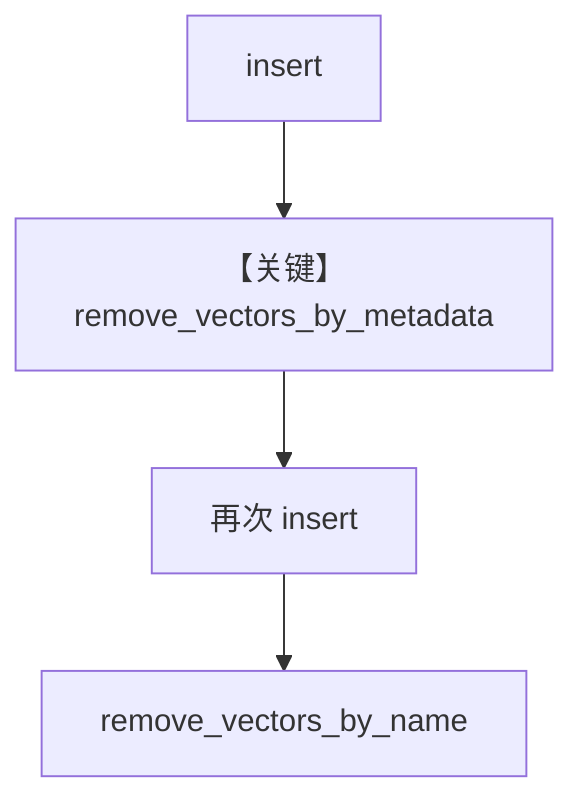

# remove_vectors.py — 实现原理分析

> 源文件：`cookbook/07_knowledge/09_archive/lifecycle/remove_vectors.py`

## 概述

本示例演示 **向量侧删除**：`remove_vectors_by_metadata` 与 `remove_vectors_by_name`，配合 `insert`/`ainsert` 展示同步与异步流程，**不包含 Agent**。

**核心配置一览：**

| 配置项 | 值 | 说明 |
|--------|-----|------|
| `vector_db` | `PgVector(table_name="vectors", ...)` | 仅向量库（无 contents_db） |
| `Knowledge` | name + description + vector_db | |
| `remove_vectors_by_metadata` | `{"user_tag": "Engineering Candidates"}` | 按元数据删向量 |
| `remove_vectors_by_name` | `"CV"` | 按入库 name 删 |
| `Agent` | 无 | |

## 架构分层

```
Knowledge.insert → PgVector 写入
       ↓
remove_vectors_by_metadata / remove_vectors_by_name
       ↓
向量表记录删除（具体语义见 PgVector 实现）
```

## 核心组件解析

### 元数据删除 vs 名称删除

二者对应不同索引/查询键；示例先按 metadata 清空一批，再重新插入后按 `name` 删除，用于演示 API 形态。

### 运行机制与因果链

1. **路径**：仅向量存储路径，无 LLM。
2. **副作用**：直接改向量数据库；异步 `run_async` 中在 `ainsert` 间混用同步 `remove_vectors_by_metadata`（与示例意图一致：展示 API 存在）。
3. **与 remove_content 差异**：本文件不写 `contents_db`，只操作向量侧。

## System Prompt 组装

无 Agent，不适用 `get_system_message`。

## 完整 API 请求

无 LLM 调用。

## Mermaid 流程图



## 关键源码文件索引

| 文件 | 作用 |
|------|------|
| `agno/knowledge/knowledge.py` | `remove_vectors_by_metadata`、`remove_vectors_by_name` |
| `agno/vectordb/pgvector/` | PostgreSQL 向量删除实现 |
