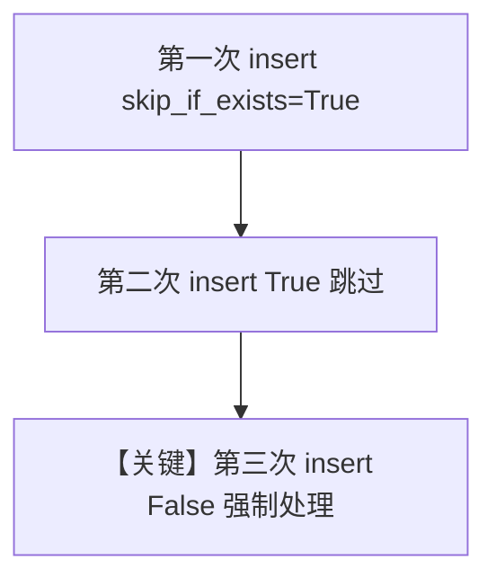

# skip_if_exists.py — 实现原理分析

> 源文件：`cookbook/07_knowledge/09_archive/lifecycle/skip_if_exists.py`

## 概述

本示例演示 **`skip_if_exists`**：重复对同一来源执行 `insert`/`ainsert` 时，第一次完整入库，第二次在 **`skip_if_exists=True`** 时跳过，**`False`** 时强制再处理。

**核心配置一览：**

| 配置项 | 值 | 说明 |
|--------|-----|------|
| `Knowledge` | `PgVector` only | |
| `skip_if_exists` | `True` / `False` 两次对比 | 控制幂等 |
| `Agent` | 无 | |

## 核心组件解析

### 幂等插入

用于避免重复嵌入与重复向量，适合定时同步任务；第二次 `skip_if_exists=False` 用于显式重建索引场景。

### 运行机制与因果链

1. **路径**：仅 Knowledge API，无模型。
2. **副作用**：第一次写入向量库；第二次 True 时跳过写，False 时可能覆盖或追加（依实现）。

## System Prompt 组装

无 Agent。

## 完整 API 请求

无 LLM。

## Mermaid 流程图

## 关键源码文件索引

| 文件 | 作用 |
|------|------|
| `agno/knowledge/knowledge.py` | `insert`/`ainsert` 的 `skip_if_exists` 分支 |
