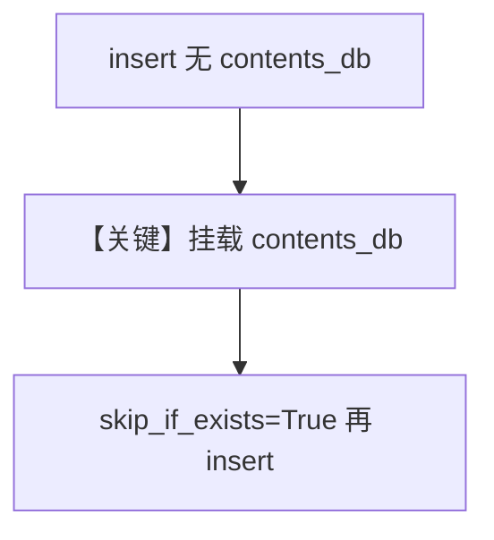

# skip_if_exists_contentsdb.py — 实现原理分析

<!-- cookbook-py-source:start -->
## 完整源码

```python
"""
Skip If Exists With Contents DB
===============================

Demonstrates adding existing vector content into a contents database using skip-if-exists.
"""

import asyncio

from agno.db.postgres.postgres import PostgresDb
from agno.knowledge.knowledge import Knowledge
from agno.vectordb.pgvector import PgVector

# ---------------------------------------------------------------------------
# Setup
# ---------------------------------------------------------------------------
vector_db = PgVector(
    table_name="vectors", db_url="postgresql+psycopg://ai:ai@localhost:5532/ai"
)


# ---------------------------------------------------------------------------
# Create Knowledge Base
# ---------------------------------------------------------------------------
def create_knowledge() -> Knowledge:
    return Knowledge(
        name="Basic SDK Knowledge Base",
        description="Agno 2.0 Knowledge Implementation",
        vector_db=vector_db,
    )


# ---------------------------------------------------------------------------
# Run Agent
# ---------------------------------------------------------------------------
def run_sync() -> None:
    knowledge = create_knowledge()
    knowledge.insert(
        name="CV",
        url="https://agno-public.s3.amazonaws.com/recipes/ThaiRecipes.pdf",
        metadata={"user_tag": "Engineering Candidates"},
        skip_if_exists=True,
    )

    contents_db = PostgresDb(
        db_url="postgresql+psycopg://ai:ai@localhost:5532/ai",
        knowledge_table="knowledge_contents",
    )
    knowledge.contents_db = contents_db

    knowledge.insert(
        name="CV",
        url="https://agno-public.s3.amazonaws.com/recipes/ThaiRecipes.pdf",
        metadata={"user_tag": "Engineering Candidates"},
        skip_if_exists=True,
    )


async def run_async() -> None:
    knowledge = create_knowledge()
    await knowledge.ainsert(
        name="CV",
        url="https://agno-public.s3.amazonaws.com/recipes/ThaiRecipes.pdf",
        metadata={"user_tag": "Engineering Candidates"},
        skip_if_exists=True,
    )

    contents_db = PostgresDb(
        db_url="postgresql+psycopg://ai:ai@localhost:5532/ai",
        knowledge_table="knowledge_contents",
    )
    knowledge.contents_db = contents_db

    await knowledge.ainsert(
        name="CV",
        url="https://agno-public.s3.amazonaws.com/recipes/ThaiRecipes.pdf",
        metadata={"user_tag": "Engineering Candidates"},
        skip_if_exists=True,
    )


if __name__ == "__main__":
    run_sync()
    asyncio.run(run_async())
```

<!-- cookbook-py-source:end -->

> 源文件：`cookbook/07_knowledge/09_archive/lifecycle/skip_if_exists_contentsdb.py`

## 概述

本示例演示：先 **仅向量路径** 插入远程 PDF；再运行时挂上 **`PostgresDb` 作为 `contents_db`**，在 **`skip_if_exists=True`** 下再次插入，用于展示「向量已存在时如何将内容纳入 contents DB」的典型集成步骤。

**核心配置一览：**

| 配置项 | 值 | 说明 |
|--------|-----|------|
| 首次 `Knowledge` | 仅 `PgVector` | 无 contents_db |
| 运行时赋值 | `knowledge.contents_db = PostgresDb(...)` | 延迟挂载 |
| `skip_if_exists` | `True` | 第二次插入行为 |
| `Agent` | 无 | |

## 核心组件解析

### contents_db 延迟绑定

先写向量再补内容库，在迁移或增量同步场景常见；具体是否仅补元数据、是否触发向量重建取决于 `Knowledge.insert` 实现。

### 运行机制与因果链

1. **路径**：两次 `insert` 同一 URL，第二次在已有向量 + 新 contents_db 条件下执行。
2. **副作用**：PostgreSQL 多表协同。

## System Prompt 组装

无 Agent。

## 完整 API 请求

无 LLM。

## Mermaid 流程图



## 关键源码文件索引

| 文件 | 作用 |
|------|------|
| `agno/knowledge/knowledge.py` | `contents_db` 与 `skip_if_exists` 协同 |
