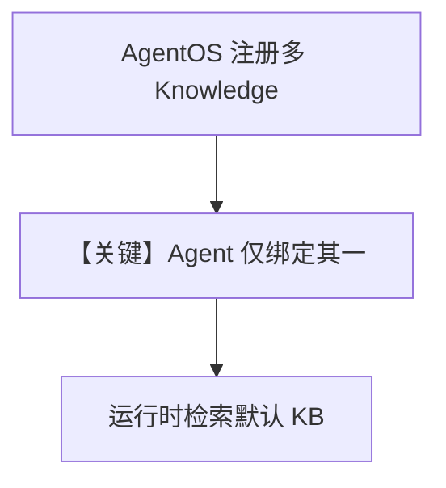

# multiple_knowledge_instances.py — 实现原理分析

> 源文件：`cookbook/07_knowledge/09_archive/os/multiple_knowledge_instances.py`

## 概述

本示例展示 **AgentOS** 注册 **多个 `Knowledge` 实例**（共享或分表 `contents_db`），HTTP 层可暴露 `/knowledge/config` 等端点；单个 `Agent` 仍只绑定其中一个 `knowledge` 作为默认检索对象。

**核心配置一览：**

| 配置项 | 值 | 说明 |
|--------|-----|------|
| `company_knowledge` / `personal_knowledge` | 共享 `vector_db` + 同 `contents_db` | 名称区分 `linked_to` 等 |
| `company_knowledge_additional` | 同名但 `company_knowledge_db` 不同 | 说明「同名不同库」独立 |
| `Agent` | `OpenAIChat(id="gpt-4o-mini")`, `knowledge=company_knowledge` | 单 Agent 单默认 KB |
| `AgentOS` | `knowledge=[...]`, `agents=[agent]` | OS 级注册多实例 |
| `search_knowledge` | `True` | |

## 架构分层

```
AgentOS.get_app() → FastAPI
   ├ 注册多个 Knowledge（配置/管理端点）
   └ Agent 运行仍走 Agent._run + 单个 agent.knowledge
```

## 核心组件解析

### AgentOS 与 Knowledge 列表

`AgentOS(knowledge=[...])` 用于 **服务级** 暴露多个知识库配置；与 **单个 Agent 构造函数里的 `knowledge=`** 不同，后者决定该 Agent 默认解析的 `Knowledge`。

### 运行机制与因果链

1. **路径**：`serve` 启动 Web → 客户端请求由路由进 Agent → `get_system_message` 仅针对 **绑定到 Agent 的那一个** `Knowledge`。
2. **副作用**：多表、多实例名；需注意隔离策略与 `isolate_vector_search` 的配合（本文件未展开）。
3. **差异**：对比「单脚本单 Knowledge」，本文件强调 **OS 级多实例注册**。

## System Prompt 组装

对 **绑定了 `company_knowledge` 的 Agent**，默认 system 含 `#3.3.13` 的 `<knowledge_base>`（`add_search_knowledge_instructions` 默认 True），外加模型默认 instruction（若有）。

### 还原后的完整 System 文本（Knowledge 段）

```text
<knowledge_base>
You have a knowledge base you can search using the search_knowledge_base tool. Search before answering questions—don't assume you know the answer. For ambiguous questions, search first rather than asking for clarification.
</knowledge_base>
```

（未设置 `description`/`instructions` 时，system 可能仅含上述块 + 模型侧片段。）

## 完整 API 请求

- **LLM**：`OpenAIChat` → Chat Completions，`gpt-4o-mini`。
- **HTTP**：`agent_os.serve` 对外暴露 FastAPI，具体路由由 AgentOS 定义。

## Mermaid 流程图



## 关键源码文件索引

| 文件 | 作用 |
|------|------|
| `agno/os/__init__.py` / AgentOS | 多 knowledge 注册与 app |
| `agno/agent/_messages.py` | `get_system_message` |
