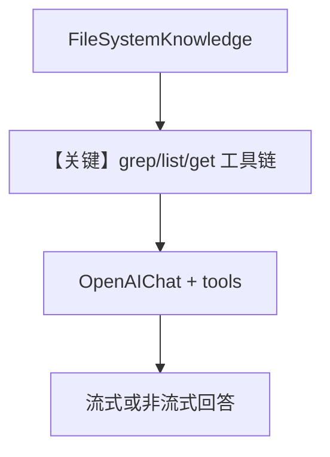

# file_system.py — 实现原理分析

<!-- cookbook-py-source:start -->
## 完整源码

```python
"""
FileSystemKnowledge Example
===========================
Demonstrates using FileSystemKnowledge to let an agent search local files.

The FileSystemKnowledge class implements the KnowledgeProtocol and provides
three tools to the agent:
- grep_file: Search for patterns in file contents
- list_files: List files matching a glob pattern
- get_file: Read the full contents of a specific file

Run: `python cookbook/07_knowledge/protocol/file_system.py`
"""

from agno.agent import Agent
from agno.knowledge.filesystem import FileSystemKnowledge
from agno.models.openai import OpenAIChat

# Create a filesystem knowledge base pointing to the agno library source
fs_knowledge = FileSystemKnowledge(
    base_dir="libs/agno/agno",
    include_patterns=["*.py"],
    exclude_patterns=[".git", "__pycache__", ".venv"],
)

if __name__ == "__main__":
    # ==========================================
    # Single agent with all three filesystem tools
    # ==========================================
    # The agent automatically gets: grep_file, list_files, get_file
    # Plus context explaining how to use them

    agent = Agent(
        model=OpenAIChat(id="gpt-4o"),
        knowledge=fs_knowledge,
        search_knowledge=True,
        instructions=(
            "You are a code assistant that helps users explore the agno codebase. "
            "Use the available tools to search, list, and read files."
        ),
        markdown=True,
    )

    # Example 1: Grep - find where something is defined
    print("\n" + "=" * 60)
    print("EXAMPLE 1: Using grep_file to find code patterns")
    print("=" * 60 + "\n")

    agent.print_response(
        "Find where the KnowledgeProtocol class is defined",
        stream=True,
    )

    # Example 2: List files in a directory
    print("\n" + "=" * 60)
    print("EXAMPLE 2: Using list_files to explore directories")
    print("=" * 60 + "\n")

    agent.print_response(
        "What Python files exist in the knowledge directory?",
        stream=True,
    )

    # Example 3: Read a specific file
    print("\n" + "=" * 60)
    print("EXAMPLE 3: Using get_file to read file contents")
    print("=" * 60 + "\n")

    agent.print_response(
        "Read the knowledge/protocol.py file and explain what it defines",
        stream=True,
    )

    # ==========================================
    # Example 4: Document search (text files only)
    # ==========================================
    # Note: FileSystemKnowledge only works with text files (md, txt, etc.)
    # For PDFs, use the main Knowledge class with proper readers
    print("\n" + "=" * 60)
    print("EXAMPLE 4: Searching document files (coffee guide)")
    print("=" * 60 + "\n")

    docs_knowledge = FileSystemKnowledge(
        base_dir="cookbook/07_knowledge/testing_resources",
        include_patterns=["*.md", "*.txt"],  # Text files only, not PDFs
        exclude_patterns=[],
    )

    docs_agent = Agent(
        model=OpenAIChat(id="gpt-4o"),
        knowledge=docs_knowledge,
        search_knowledge=True,
        instructions="You are a helpful assistant that answers questions from documents.",
        markdown=True,
    )

    docs_agent.print_response(
        "What knowledge do you have about coffee? Which coffee region produces Bright and nutty notes?",
        stream=True,
    )
```

<!-- cookbook-py-source:end -->

> 源文件：`cookbook/07_knowledge/09_archive/protocol/file_system.py`

## 概述

本示例使用 **`FileSystemKnowledge`**（实现 `KnowledgeProtocol`），为 Agent 提供 **`grep_file` / `list_files` / `get_file`** 等工具，在 **本地目录** 上模拟「可搜索的知识」；第二段用小型文档目录演示纯文本检索限制。

**核心配置一览：**

| 配置项 | 值 | 说明 |
|--------|-----|------|
| `FileSystemKnowledge` | `base_dir`, `include_patterns`, `exclude_patterns` | 代码库或文档根 |
| `Agent` 1 | `OpenAIChat(id="gpt-4o")`, `instructions` 长字符串 | 探索 agno 源码 |
| `Agent` 2 | `docs_knowledge` + 简短 `instructions` | 咖啡文档问答 |
| `search_knowledge` | `True` | 挂载协议提供的工具 |
| `markdown` | `True` | |

## 架构分层

```
FileSystemKnowledge.get_tools() → 文件类工具
        │
        ▼
get_system_message → KnowledgeProtocol.build_context()（若实现）
        │
        ▼
OpenAIChat Chat Completions + tools
```

## 核心组件解析

### KnowledgeProtocol 与内置工具

与向量 RAG 不同，**不必**有嵌入表；工具直接读本地文件系统，由 `instructions` 约束使用方式。

### `FileSystemKnowledge.build_context`

在 `agno/knowledge/filesystem.py` 中实现，会向 system 注入如何使用各工具的说明（若走默认 Agent 拼装路径）。

### 运行机制与因果链

1. **路径**：用户自然语言 → 模型选工具 → 读文件/grep → 再答。
2. **副作用**：只读本地文件（应限制 `base_dir` 防止路径穿越，依赖实现）。
3. **分支**：`stream=True` 时走流式响应。
4. **差异**：对比 `Knowledge`+`PgVector`，本示例 **无向量库**。

## System Prompt 组装

| 组成部分 | Agent 1 |
|-----------|---------|
| `instructions` | `"You are a code assistant..."` |
| `#3.3.13` | `FileSystemKnowledge.build_context()` 若返回非空则追加 |

### 还原后的完整 System 文本（指令部分，可静态还原）

```text
You are a code assistant that helps users explore the agno codebase. Use the available tools to search, list, and read files.
```

（其后接 `FileSystemKnowledge` 生成的工具说明；完整正文需 `build_context()` 运行时值或阅读 `filesystem.py`。）

## 完整 API 请求

`OpenAIChat` → `chat.completions.create`，`tools` 含文件操作 schema；`stream=True` 时走流式接口。

## Mermaid 流程图



## 关键源码文件索引

| 文件 | 作用 |
|------|------|
| `agno/knowledge/filesystem.py` | `FileSystemKnowledge`、`build_context` |
| `agno/knowledge/protocol.py` | `KnowledgeProtocol` |
| `agno/models/openai/chat.py` | `OpenAIChat.invoke` |
