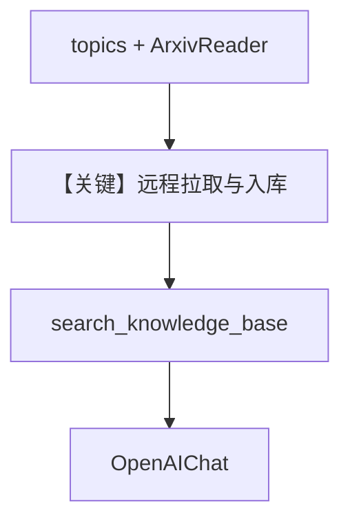

# arxiv_reader.py — 实现原理分析

<!-- cookbook-py-source:start -->
## 完整源码

```python
from agno.agent import Agent
from agno.knowledge.knowledge import Knowledge
from agno.knowledge.reader.arxiv_reader import ArxivReader
from agno.vectordb.pgvector import PgVector

db_url = "postgresql+psycopg://ai:ai@localhost:5532/ai"

# Create a knowledge base with the ArXiv documents
knowledge = Knowledge(
    # Table name: ai.arxiv_documents
    vector_db=PgVector(
        table_name="arxiv_documents",
        db_url=db_url,
    ),
)
# Load the knowledge
knowledge.insert(
    topics=["Generative AI", "Machine Learning"],
    reader=ArxivReader(),
)

# Create an agent with the knowledge
agent = Agent(
    knowledge=knowledge,
    search_knowledge=True,
)

# Ask the agent about the knowledge
agent.print_response("What can you tell me about Generative AI?", markdown=True)
```

<!-- cookbook-py-source:end -->

> 源文件：`cookbook/07_knowledge/09_archive/readers/arxiv_reader.py`

## 概述

使用 **`ArxivReader`** 按主题从 arXiv 拉取论文、写入 **`PgVector`**，再由默认 **`Agent`**（`search_knowledge=True`）回答。

**核心配置一览：**

| 配置项 | 值 | 说明 |
|--------|-----|------|
| `Knowledge` | `vector_db=PgVector(table_name="arxiv_documents")` | |
| `insert` | `topics=[...]`, `reader=ArxivReader()`` | 主题驱动入库 |
| `Agent` | 仅 `knowledge` + `search_knowledge=True` | 默认 `gpt-4o` |

## 架构分层

```
ArxivReader → 文档 → embed → PgVector
                    → Agent + search_knowledge_base → OpenAIChat
```

## 核心组件解析

### ArxivReader

封装对 arXiv API/源的读取，产出 `Document` 再进入常规分块与向量流水线。

### 运行机制与因果链

1. **路径**：主题 → 读论文 → 入库 → 用户提问 → 检索工具 → 回答。
2. **副作用**：网络请求 + DB 写入；需可用 Postgres。

## System Prompt 组装

无显式 `description`/`instructions`；含默认 `#3.3.13` `<knowledge_base>` 段。

### 还原后的完整 System 文本（knowledge 段）

```text
<knowledge_base>
You have a knowledge base you can search using the search_knowledge_base tool. Search before answering questions—don't assume you know the answer. For ambiguous questions, search first rather than asking for clarification.
</knowledge_base>
```

## 完整 API 请求

`OpenAIChat` Chat Completions，默认 `gpt-4o`。

## Mermaid 流程图



## 关键源码文件索引

| 文件 | 作用 |
|------|------|
| `agno/knowledge/reader/arxiv_reader.py` | ArxivReader |
| `agno/knowledge/knowledge.py` | `insert` |
