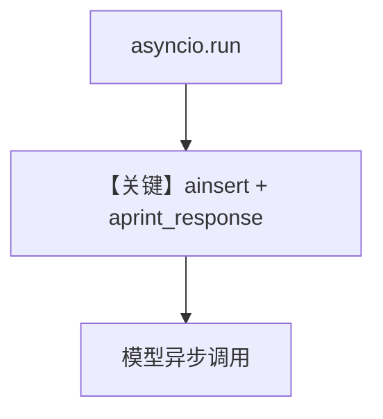

# arxiv_reader_async.py — 实现原理分析

> 源文件：`cookbook/07_knowledge/09_archive/readers/arxiv_reader_async.py`

## 概述

与同步版相同的数据模型，改用 **`knowledge.ainsert`** 与 **`agent.aprint_response`**，在 **asyncio** 事件循环中完成入库与对话。

**核心配置一览：**

| 配置项 | 值 | 说明 |
|--------|-----|------|
| `ainsert` | `topics` + `ArxivReader()` | 异步入库 |
| `aprint_response` | 异步响应 | |

## 核心组件解析

### 异步 API

`Knowledge` 与 `Agent` 的 `a*` 方法避免阻塞事件循环，适合与 async Web 框架集成。

### 运行机制与因果链

同 `arxiv_reader.py`，差别仅在 **调用栈为 async**。

## System Prompt 组装

同默认 Agent + Knowledge，含 `<knowledge_base>` 段。

## 完整 API 请求

底层仍为 `OpenAIChat` 异步 `ainvoke`（或等价路径）。

## Mermaid 流程图

## 关键源码文件索引

| 文件 | 作用 |
|------|------|
| `agno/knowledge/knowledge.py` | `ainsert` |
| `agno/agent/agent.py` | `aprint_response` |
