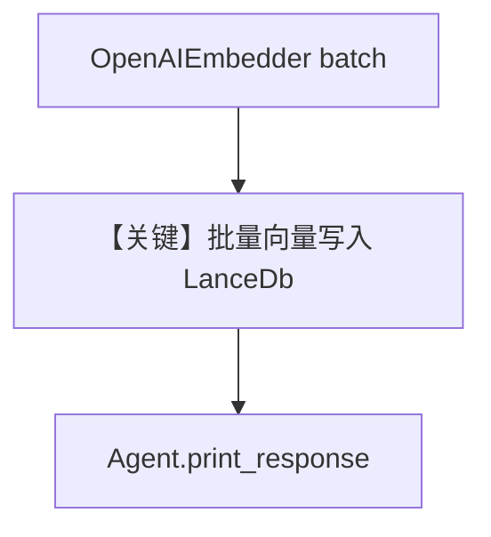

# batching.py — 实现原理分析

<!-- cookbook-py-source:start -->
## 完整源码

```python
"""
Batching
========

Demonstrates knowledge insertion with batch embeddings using sync and async APIs.
"""

import asyncio

from agno.agent import Agent
from agno.knowledge.embedder.openai import OpenAIEmbedder
from agno.knowledge.knowledge import Knowledge
from agno.vectordb.lancedb import LanceDb


# ---------------------------------------------------------------------------
# Setup
# ---------------------------------------------------------------------------
def create_vector_db() -> LanceDb:
    return LanceDb(
        uri="tmp/lancedb",
        table_name="vectors",
        embedder=OpenAIEmbedder(
            batch_size=1000,
            dimensions=1536,
            enable_batch=True,
        ),
    )


# ---------------------------------------------------------------------------
# Create Knowledge Base
# ---------------------------------------------------------------------------
def create_knowledge() -> Knowledge:
    return Knowledge(
        name="Basic SDK Knowledge Base",
        description="Agno 2.0 Knowledge Implementation",
        vector_db=create_vector_db(),
    )


# ---------------------------------------------------------------------------
# Create Agent
# ---------------------------------------------------------------------------
def create_agent(knowledge: Knowledge) -> Agent:
    return Agent(
        name="My Agent",
        description="Agno 2.0 Agent Implementation",
        knowledge=knowledge,
        search_knowledge=True,
        debug_mode=True,
    )


# ---------------------------------------------------------------------------
# Run Agent
# ---------------------------------------------------------------------------
def run_sync() -> None:
    knowledge = create_knowledge()
    knowledge.insert(
        name="CV",
        path="cookbook/07_knowledge/testing_resources/cv_1.pdf",
        metadata={"user_tag": "Engineering Candidates"},
    )

    agent = create_agent(knowledge)
    agent.print_response(
        "What skills does Jordan Mitchell have?",
        markdown=True,
    )


async def run_async() -> None:
    knowledge = create_knowledge()
    await knowledge.ainsert(
        name="CV",
        path="cookbook/07_knowledge/testing_resources/cv_1.pdf",
        metadata={"user_tag": "Engineering Candidates"},
    )

    agent = create_agent(knowledge)
    agent.print_response(
        "What skills does Jordan Mitchell have?",
        markdown=True,
    )


if __name__ == "__main__":
    run_sync()
    asyncio.run(run_async())
```

<!-- cookbook-py-source:end -->

> 源文件：`cookbook/07_knowledge/09_archive/readers/batching.py`

## 概述

演示 **`OpenAIEmbedder(enable_batch=True, batch_size=1000, ...)`** 与 **`LanceDb`** 组合，在同步/异步 `insert`/`ainsert` 时批量生成向量，降低嵌入 API 调用次数。

**核心配置一览：**

| 配置项 | 值 | 说明 |
|--------|-----|------|
| `LanceDb` | `uri=tmp/lancedb`, embedder 带 batch | |
| `Agent` | `name`/`description`/`debug_mode=True` | 默认模型 |
| `insert` | 本地 PDF 路径 | |

## 核心组件解析

### 批量嵌入

`enable_batch=True` 时，Embedder 可合并多条文本再请求嵌入服务（具体批策略见 `OpenAIEmbedder` 实现）。

### 运行机制与因果链

1. **路径**：读 PDF → 分块 → 批量 embed → LanceDB。
2. **副作用**：本地 `tmp/lancedb` 目录。

## System Prompt 组装

含 `description`：`"Agno 2.0 Agent Implementation"`；以及 `<knowledge_base>`。

### 还原片段

```text
Agno 2.0 Agent Implementation

<knowledge_base>
You have a knowledge base you can search using the search_knowledge_base tool. Search before answering questions—don't assume you know the answer. For ambiguous questions, search first rather than asking for clarification.
</knowledge_base>
```

## 完整 API 请求

- **LLM**：默认 `gpt-4o` Chat Completions。
- **Embeddings**：OpenAI Embeddings API（由 `OpenAIEmbedder` 发起）。

## Mermaid 流程图



## 关键源码文件索引

| 文件 | 作用 |
|------|------|
| `agno/knowledge/embedder/openai.py` | `OpenAIEmbedder` batch |
| `agno/vectordb/lancedb/` | LanceDb |
