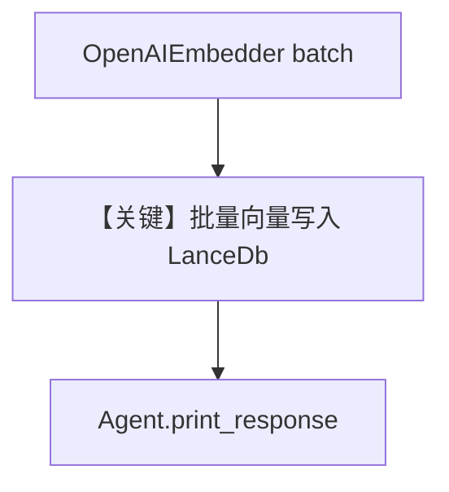

# batching.py — 实现原理分析

> 源文件：`cookbook/07_knowledge/09_archive/readers/batching.py`

## 概述

演示 **`OpenAIEmbedder(enable_batch=True, batch_size=1000, ...)`** 与 **`LanceDb`** 组合，在同步/异步 `insert`/`ainsert` 时批量生成向量，降低嵌入 API 调用次数。

**核心配置一览：**

| 配置项 | 值 | 说明 |
|--------|-----|------|
| `LanceDb` | `uri=tmp/lancedb`, embedder 带 batch | |
| `Agent` | `name`/`description`/`debug_mode=True` | 默认模型 |
| `insert` | 本地 PDF 路径 | |

## 核心组件解析

### 批量嵌入

`enable_batch=True` 时，Embedder 可合并多条文本再请求嵌入服务（具体批策略见 `OpenAIEmbedder` 实现）。

### 运行机制与因果链

1. **路径**：读 PDF → 分块 → 批量 embed → LanceDB。
2. **副作用**：本地 `tmp/lancedb` 目录。

## System Prompt 组装

含 `description`：`"Agno 2.0 Agent Implementation"`；以及 `<knowledge_base>`。

### 还原片段

```text
Agno 2.0 Agent Implementation

<knowledge_base>
You have a knowledge base you can search using the search_knowledge_base tool. Search before answering questions—don't assume you know the answer. For ambiguous questions, search first rather than asking for clarification.
</knowledge_base>
```

## 完整 API 请求

- **LLM**：默认 `gpt-4o` Chat Completions。
- **Embeddings**：OpenAI Embeddings API（由 `OpenAIEmbedder` 发起）。

## Mermaid 流程图



## 关键源码文件索引

| 文件 | 作用 |
|------|------|
| `agno/knowledge/embedder/openai.py` | `OpenAIEmbedder` batch |
| `agno/vectordb/lancedb/` | LanceDb |
