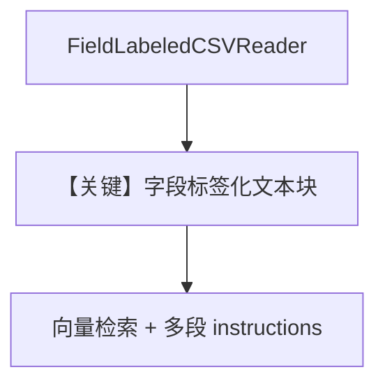

# csv_field_labeled_reader.py — 实现原理分析

> 源文件：`cookbook/07_knowledge/09_archive/readers/csv_field_labeled_reader.py`

## 概述

使用 **`FieldLabeledCSVReader`** 将 IMDB CSV 转为「字段标签 + 值」的可读文本再入库；`instructions` 为多段列表，指导模型按字段结构理解检索结果。

**核心配置一览：**

| 配置项 | 值 | 说明 |
|--------|-----|------|
| `reader` | `FieldLabeledCSVReader(chunk_title=..., field_names=..., format_headers=True)` | 字段化展示 |
| `Knowledge` | `PgVector(table_name="imdb_movies_field_labeled_readr")` | 注意表名拼写 |
| `Agent` | `instructions` 为 `list[str]`（5 条电影助手规则） | `use_instruction_tags` 默认下会格式化 |
| `search_knowledge` | `True` | |
| `print_response` | `stream=True` | |

## 核心组件解析

### 多段 `instructions`

`get_system_message` 在 `len(instructions)>1` 且 `use_instruction_tags` 时包进 `<instructions>` 列表（见 `_messages.py` #3.3.3）。

### 运行机制与因果链

入库用远程 CSV URL；检索时模型需结合字段标签回答「诺兰执导」等问题。

## System Prompt 组装

### 还原后的 instructions（字面量）

```text
You are a movie expert assistant.
Use the search_knowledge_base tool to find detailed information about movies.
The movie data is formatted in a field-labeled, human-readable way with clear field labels.
Each movie entry starts with 'Movie Information' followed by labeled fields.
Provide comprehensive answers based on the movie information available.
```

其后接 `<knowledge_base>...</knowledge_base>`（若未关闭 `add_search_knowledge_instructions`）。

## 完整 API 请求

默认 `gpt-4o`，Chat Completions；`stream=True` 走流式。

## Mermaid 流程图



## 关键源码文件索引

| 文件 | 作用 |
|------|------|
| `agno/knowledge/reader/field_labeled_csv_reader.py` | Reader 实现 |
| `agno/agent/_messages.py` | `#3.3.3` instructions |
