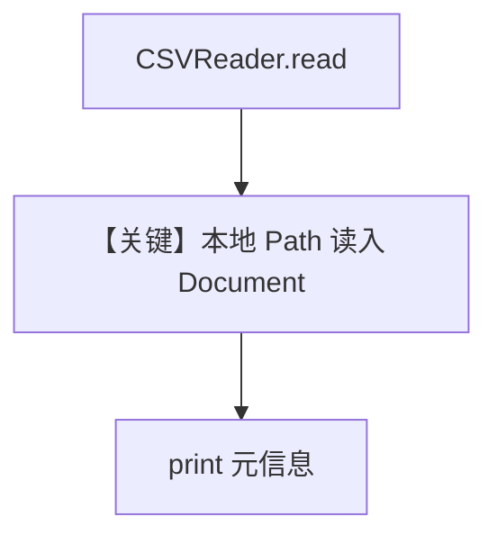

# csv_reader.py — 实现原理分析

<!-- cookbook-py-source:start -->
## 完整源码

```python
from pathlib import Path

from agno.knowledge.reader.csv_reader import CSVReader

reader = CSVReader()

csv_path = Path("tmp/test.csv")


try:
    print("Starting read...")
    documents = reader.read(csv_path)

    if documents:
        for doc in documents:
            print(doc.name)
            # print(doc.content)
            print(f"Content length: {len(doc.content)}")
            print("-" * 80)
    else:
        print("No documents were returned")

except Exception as e:
    print(f"Error type: {type(e)}")
    print(f"Error occurred: {str(e)}")
```

<!-- cookbook-py-source:end -->

> 源文件：`cookbook/07_knowledge/09_archive/readers/csv_reader.py`

## 概述

本文件 **仅演示 `CSVReader.read(Path)`**：直接打印文档名与内容长度，**无 `Knowledge`、无 `Agent`**，用于调试 Reader 行为。

**核心配置一览：**

| 配置项 | 值 | 说明 |
|--------|-----|------|
| `CSVReader()` | 实例化 | |
| `csv_path` | `tmp/test.csv` | 需自备测试文件 |
| `Agent` / `Knowledge` | 无 | |

## 核心组件解析

### CSVReader

同步读取 CSV 为 `Document` 列表；异常时打印错误类型与信息。

## System Prompt 组装

无 LLM，无 `get_system_message`。

## 完整 API 请求

无。

## Mermaid 流程图



## 关键源码文件索引

| 文件 | 作用 |
|------|------|
| `agno/knowledge/reader/csv_reader.py` | `CSVReader` |
