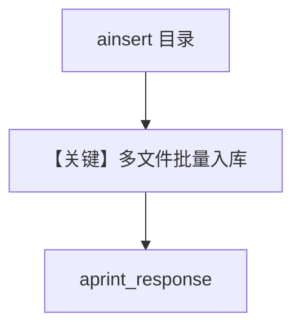

# csv_reader_async.py — 实现原理分析

> 源文件：`cookbook/07_knowledge/09_archive/readers/csv_reader_async.py`

## 概述

从目录 **`data/csv`** 异步入库（`ainsert(path=Path)`），`Knowledge` 设置 **`max_results=5`** 限制单次检索返回条数；`Agent` 默认模型 + `search_knowledge=True`。

**核心配置一览：**

| 配置项 | 值 | 说明 |
|--------|-----|------|
| `max_results` | `5` | Knowledge 检索上限 |
| `ainsert` | 目录 Path | 批量 CSV |
| `aprint_response` | `"What is the csv file about"` | |

## 核心组件解析

### `max_results`

影响 `search_knowledge_base` 或内部 search 的默认 `limit`（以 `Knowledge` 实现为准）。

## System Prompt 组装

默认 `<knowledge_base>` + 无自定义 description/instructions。

## 完整 API 请求

`OpenAIChat` 异步路径。

## Mermaid 流程图

## 关键源码文件索引

| 文件 | 作用 |
|------|------|
| `agno/knowledge/knowledge.py` | `max_results`、`ainsert` |
