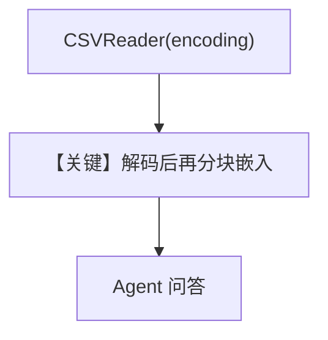

# csv_reader_custom_encodings.py — 实现原理分析

<!-- cookbook-py-source:start -->
## 完整源码

```python
import asyncio

from agno.agent import Agent
from agno.knowledge.knowledge import Knowledge
from agno.knowledge.reader.csv_reader import CSVReader
from agno.models.openai import OpenAIChat
from agno.vectordb.pgvector import PgVector

db_url = "postgresql+psycopg://ai:ai@localhost:5532/ai"

knowledge = Knowledge(
    vector_db=PgVector(
        table_name="csv_documents",
        db_url=db_url,
    ),
    max_results=5,  # Number of results to return on search
)

# Initialize the Agent with the knowledge
agent = Agent(
    model=OpenAIChat(id="gpt-4.1-mini"),
    knowledge=knowledge,
    search_knowledge=True,
)


if __name__ == "__main__":
    # Comment out after first run
    asyncio.run(
        knowledge.ainsert(
            url="https://agno-public.s3.amazonaws.com/demo_data/IMDB-Movie-Data.csv",
            reader=CSVReader(encoding="gb2312"),
        )
    )

    # Create and use the agent
    asyncio.run(agent.aprint_response("What is the csv file about", markdown=True))
```

<!-- cookbook-py-source:end -->

> 源文件：`cookbook/07_knowledge/09_archive/readers/csv_reader_custom_encodings.py`

## 概述

在异步入库时传入 **`CSVReader(encoding="gb2312")`**，演示 **非 UTF-8** 编码 CSV 的读取；`Agent` 显式 **`OpenAIChat(id="gpt-4.1-mini")`**。

**核心配置一览：**

| 配置项 | 值 | 说明 |
|--------|-----|------|
| `model` | `OpenAIChat(id="gpt-4.1-mini")` | Chat Completions |
| `reader` | `CSVReader(encoding="gb2312")` | 编码 |
| `max_results` | `5` | |

## 核心组件解析

### 编码参数

`CSVReader` 将字节按指定编码解码后再分块，错误编码会导致乱码或异常。

## System Prompt 组装

默认 knowledge 块；无额外 `instructions`。

## 完整 API 请求

`gpt-4.1-mini`，`chat.completions` 系。

## Mermaid 流程图



## 关键源码文件索引

| 文件 | 作用 |
|------|------|
| `agno/knowledge/reader/csv_reader.py` | 编码参数 |
