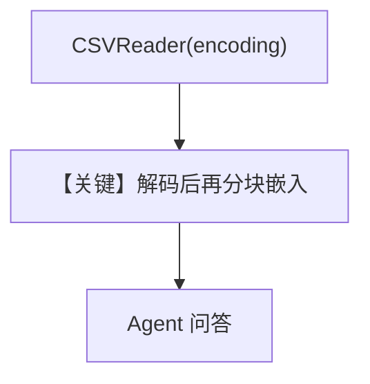

# csv_reader_custom_encodings.py — 实现原理分析

> 源文件：`cookbook/07_knowledge/09_archive/readers/csv_reader_custom_encodings.py`

## 概述

在异步入库时传入 **`CSVReader(encoding="gb2312")`**，演示 **非 UTF-8** 编码 CSV 的读取；`Agent` 显式 **`OpenAIChat(id="gpt-4.1-mini")`**。

**核心配置一览：**

| 配置项 | 值 | 说明 |
|--------|-----|------|
| `model` | `OpenAIChat(id="gpt-4.1-mini")` | Chat Completions |
| `reader` | `CSVReader(encoding="gb2312")` | 编码 |
| `max_results` | `5` | |

## 核心组件解析

### 编码参数

`CSVReader` 将字节按指定编码解码后再分块，错误编码会导致乱码或异常。

## System Prompt 组装

默认 knowledge 块；无额外 `instructions`。

## 完整 API 请求

`gpt-4.1-mini`，`chat.completions` 系。

## Mermaid 流程图

## 关键源码文件索引

| 文件 | 作用 |
|------|------|
| `agno/knowledge/reader/csv_reader.py` | 编码参数 |
