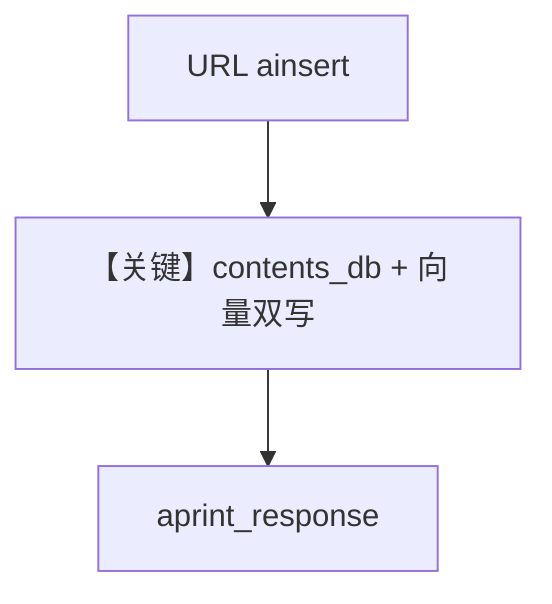

# csv_reader_url_async.py — 实现原理分析

> 源文件：`cookbook/07_knowledge/09_archive/readers/csv_reader_url_async.py`

## 概述

`Knowledge` 同时配置 **`PgVector`** 与 **`PostgresDb` 作 `contents_db`**；`ainsert` 使用 **默认 CSV 读取**（不显式传 `CSVReader`）从 URL 拉取 IMDB 数据。

**核心配置一览：**

| 配置项 | 值 | 说明 |
|--------|-----|------|
| `contents_db` | `PostgresDb(db_url=...)` | 内容持久化 |
| `aprint_response` | 问电影类型 | |

## 核心组件解析

### URL + 默认 Reader

`insert`/`ainsert` 根据 MIME/扩展名选择 Reader；CSV URL 走 CSV 管线。

## System Prompt 组装

默认 knowledge 段。

## 完整 API 请求

默认 `gpt-4o`。

## Mermaid 流程图

## 关键源码文件索引

| 文件 | 作用 |
|------|------|
| `agno/knowledge/knowledge.py` | URL 入库与 contents |
