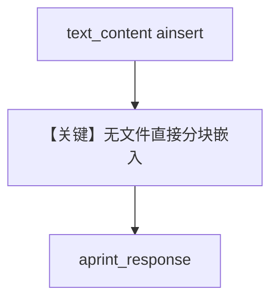

# doc_kb_async.py — 实现原理分析

> 源文件：`cookbook/07_knowledge/09_archive/readers/doc_kb_async.py`

## 概述

向 `Knowledge` 直接传入 **`text_content`** 字符串（地球趣味知识），异步入库后 **`aprint_response`** 提问。未显式设置 `Agent.search_knowledge`，**默认为 `True`**（`Agent` 类定义）。

**核心配置一览：**

| 配置项 | 值 | 说明 |
|--------|-----|------|
| `ainsert` | `text_content=fun_facts` | 纯文本入库 |
| `Agent` | 仅 `knowledge=knowledge` | 依赖默认 `search_knowledge=True` |

## 核心组件解析

### 纯文本入库

无需文件路径；适合短知识、FAQ 注入。

## System Prompt 组装

含默认 `<knowledge_base>` 段。

## 完整 API 请求

默认 `gpt-4o`，异步。

## Mermaid 流程图

## 关键源码文件索引

| 文件 | 作用 |
|------|------|
| `agno/knowledge/knowledge.py` | `text_content` 插入 |
