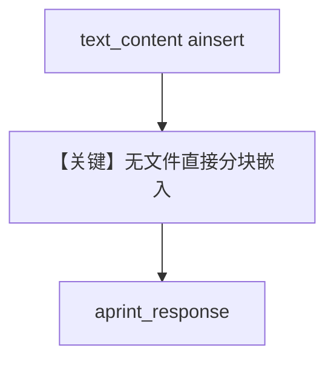

# doc_kb_async.py — 实现原理分析

<!-- cookbook-py-source:start -->
## 完整源码

```python
import asyncio

from agno.agent import Agent
from agno.knowledge.knowledge import Knowledge
from agno.vectordb.pgvector import PgVector

fun_facts = """
- Earth is the third planet from the Sun and the only known astronomical object to support life.
- Approximately 71% of Earth's surface is covered by water, with the Pacific Ocean being the largest.
- The Earth's atmosphere is composed mainly of nitrogen (78%) and oxygen (21%), with traces of other gases.
- Earth rotates on its axis once every 24 hours, leading to the cycle of day and night.
- The planet has one natural satellite, the Moon, which influences tides and stabilizes Earth's axial tilt.
- Earth's tectonic plates are constantly shifting, leading to geological activities like earthquakes and volcanic eruptions.
- The highest point on Earth is Mount Everest, standing at 8,848 meters (29,029 feet) above sea level.
- The deepest part of the ocean is the Mariana Trench, reaching depths of over 11,000 meters (36,000 feet).
- Earth has a diverse range of ecosystems, from rainforests and deserts to coral reefs and tundras.
- The planet's magnetic field protects life by deflecting harmful solar radiation and cosmic rays.
"""

# Database connection URL
db_url = "postgresql+psycopg://ai:ai@localhost:5532/ai"

knowledge = Knowledge(
    vector_db=PgVector(
        table_name="documents",
        db_url=db_url,
    ),
)

# Create an agent with the knowledge
agent = Agent(
    knowledge=knowledge,
)


async def main():
    # Load the knowledge
    await knowledge.ainsert(
        text_content=fun_facts,
    )

    # Ask the agent about the knowledge
    await agent.aprint_response("Could you tell me about the earth?", markdown=True)


if __name__ == "__main__":
    asyncio.run(main())
```

<!-- cookbook-py-source:end -->

> 源文件：`cookbook/07_knowledge/09_archive/readers/doc_kb_async.py`

## 概述

向 `Knowledge` 直接传入 **`text_content`** 字符串（地球趣味知识），异步入库后 **`aprint_response`** 提问。未显式设置 `Agent.search_knowledge`，**默认为 `True`**（`Agent` 类定义）。

**核心配置一览：**

| 配置项 | 值 | 说明 |
|--------|-----|------|
| `ainsert` | `text_content=fun_facts` | 纯文本入库 |
| `Agent` | 仅 `knowledge=knowledge` | 依赖默认 `search_knowledge=True` |

## 核心组件解析

### 纯文本入库

无需文件路径；适合短知识、FAQ 注入。

## System Prompt 组装

含默认 `<knowledge_base>` 段。

## 完整 API 请求

默认 `gpt-4o`，异步。

## Mermaid 流程图



## 关键源码文件索引

| 文件 | 作用 |
|------|------|
| `agno/knowledge/knowledge.py` | `text_content` 插入 |
