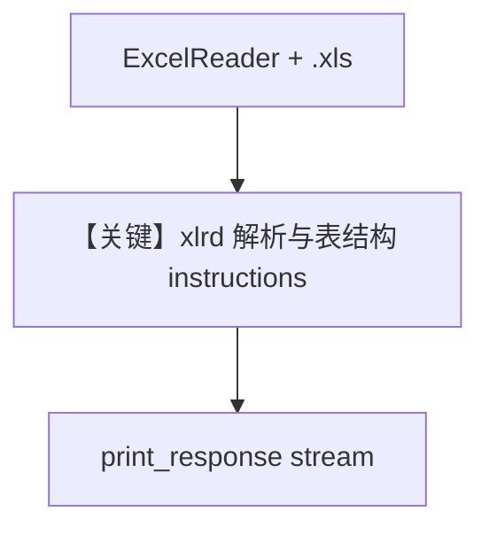

# excel_legacy_xls.py — 实现原理分析

> 源文件：`cookbook/07_knowledge/09_archive/readers/excel_legacy_xls.py`

## 概述

**`ExcelReader`** 通过 **xlrd** 读 **`.xls`** 老格式；示例用测试资源 **`legacy_data.xls`** 入库，并用 **多段 `instructions`** 描述表结构（Sales / Inventory）。

**核心配置一览：**

| 配置项 | 值 | 说明 |
|--------|-----|------|
| `model` | `OpenAIChat(id="gpt-4o-mini")` | |
| `instructions` | 列表：legacy Excel、两 sheet 列说明 | |
| `insert` | `path` + `reader=ExcelReader()` | |

## 核心组件解析

### .xls 与日期/布尔

Reader 将 Excel 序列日期转 ISO，0/1 转布尔（见文件头注释）。

## System Prompt 组装

`instructions` 多段进入 `<instructions>`（默认 tag 模式下）；外加 `<knowledge_base>`。

### 可还原 instructions 摘要

见源码 L34-L40（逐字引用请以 `.py` 为准）。

## 完整 API 请求

`gpt-4o-mini` Chat Completions；`stream=True`。

## Mermaid 流程图

## 关键源码文件索引

| 文件 | 作用 |
|------|------|
| `agno/knowledge/reader/excel_reader.py` | xls/xlsx |
