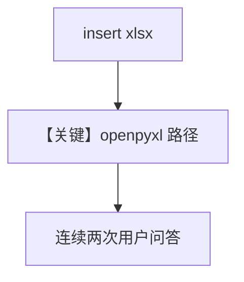

# excel_reader.py — 实现原理分析

<!-- cookbook-py-source:start -->
## 完整源码

```python
from agno.agent import Agent
from agno.knowledge.knowledge import Knowledge
from agno.knowledge.reader.excel_reader import ExcelReader
from agno.models.openai import OpenAIChat
from agno.vectordb.pgvector import PgVector

db_url = "postgresql+psycopg://ai:ai@localhost:5532/ai"

reader = ExcelReader()

knowledge_base = Knowledge(
    vector_db=PgVector(
        table_name="excel_products_demo",
        db_url=db_url,
    ),
)

# Insert Excel file - ExcelReader uses openpyxl for .xlsx, xlrd for .xls
knowledge_base.insert(
    path="cookbook/07_knowledge/testing_resources/sample_products.xlsx",
    reader=reader,
)

agent = Agent(
    model=OpenAIChat(id="gpt-4o-mini"),
    knowledge=knowledge_base,
    search_knowledge=True,
    instructions=[
        "You are a product catalog assistant.",
        "Use the knowledge base to answer questions about products.",
        "The data comes from an Excel workbook with Products and Categories sheets.",
    ],
)

if __name__ == "__main__":
    agent.print_response(
        "What electronics products are currently in stock? Include their prices.",
        markdown=True,
        stream=True,
    )
    agent.print_response(
        "What is the price of the Bluetooth speaker?",
        markdown=True,
        stream=True,
    )
```

<!-- cookbook-py-source:end -->

> 源文件：`cookbook/07_knowledge/09_archive/readers/excel_reader.py`

## 概述

读取 **`sample_products.xlsx`**（openpyxl），`instructions` 说明 Products/Categories 工作表；两次 `print_response` 查询库存与价格。

**核心配置一览：**

| 配置项 | 值 | 说明 |
|--------|-----|------|
| `OpenAIChat` | `gpt-4o-mini` | |
| `instructions` | 产品目录助手 3 条 | |

## 核心组件解析

与 legacy xls 相比，本文件走 **现代 xlsx** 路径（同 `ExcelReader` 类，底层库分支不同）。

## System Prompt 组装

多段 instructions + knowledge 块。

## 完整 API 请求

Chat Completions，流式。

## Mermaid 流程图



## 关键源码文件索引

| 文件 | 作用 |
|------|------|
| `agno/knowledge/reader/excel_reader.py` | |
