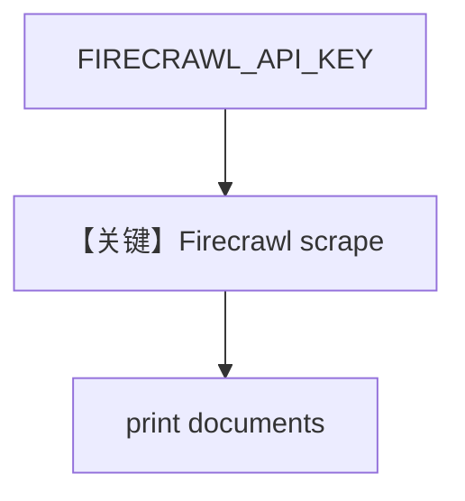

# firecrawl_reader.py — 实现原理分析

> 源文件：`cookbook/07_knowledge/09_archive/readers/firecrawl_reader.py`

## 概述

仅调用 **`FirecrawlReader`** 抓取 GitHub 页面，打印文档块；**无 Knowledge / Agent**，需 **`FIRECRAWL_API_KEY`**。

**核心配置一览：**

| 配置项 | 值 | 说明 |
|--------|-----|------|
| `FirecrawlReader` | `mode="scrape"`, `chunk=True`, `params` | scrape 模式 |
| LLM | 无 | |

## 核心组件解析

### Firecrawl 集成

将 URL 转为 `Document` 列表，供后续自行接入 `Knowledge.insert`。

## System Prompt 组装

无 Agent。

## 完整 API 请求

无 LLM；仅有 Firecrawl HTTP API（由 Reader 发起）。

## Mermaid 流程图

## 关键源码文件索引

| 文件 | 作用 |
|------|------|
| `agno/knowledge/reader/firecrawl_reader.py` | |
