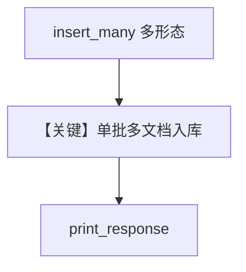

# from_multiple_sources.py — 实现原理分析

<!-- cookbook-py-source:start -->
## 完整源码

```python
"""
From Multiple Sources
=====================

Demonstrates loading knowledge from multiple paths and URLs using sync and async operations.
"""

import asyncio

from agno.agent import Agent
from agno.knowledge.embedder.openai import OpenAIEmbedder
from agno.knowledge.knowledge import Knowledge
from agno.models.openai import OpenAIChat
from agno.vectordb.pgvector import PgVector


# ---------------------------------------------------------------------------
# Setup
# ---------------------------------------------------------------------------
def create_sync_knowledge() -> Knowledge:
    return Knowledge(
        name="Basic SDK Knowledge Base",
        description="Agno 2.0 Knowledge Implementation",
        vector_db=PgVector(
            table_name="vectors", db_url="postgresql+psycopg://ai:ai@localhost:5532/ai"
        ),
    )


def create_async_knowledge() -> Knowledge:
    return Knowledge(
        name="Basic SDK Knowledge Base",
        description="Agno 2.0 Knowledge Implementation",
        vector_db=PgVector(
            table_name="vectors",
            db_url="postgresql+psycopg://ai:ai@localhost:5532/ai",
            embedder=OpenAIEmbedder(),
        ),
    )


# ---------------------------------------------------------------------------
# Create Agent
# ---------------------------------------------------------------------------
def create_sync_agent(knowledge: Knowledge) -> Agent:
    return Agent(knowledge=knowledge, search_knowledge=True)


def create_async_agent(knowledge: Knowledge) -> Agent:
    return Agent(
        model=OpenAIChat(id="gpt-4o-mini"),
        knowledge=knowledge,
        search_knowledge=True,
    )


# ---------------------------------------------------------------------------
# Run Agent
# ---------------------------------------------------------------------------
def run_sync() -> None:
    knowledge = create_sync_knowledge()

    knowledge.insert_many(
        [
            {
                "name": "CV's",
                "path": "cookbook/07_knowledge/testing_resources/cv_1.pdf",
                "metadata": {"user_tag": "Engineering candidates"},
            },
            {
                "name": "Docs",
                "url": "https://docs.agno.com/introduction",
                "metadata": {"user_tag": "Documents"},
            },
        ]
    )

    knowledge.insert_many(
        urls=[
            "https://agno-public.s3.amazonaws.com/recipes/ThaiRecipes.pdf",
            "https://docs.agno.com/introduction",
            "https://docs.agno.com/knowledge/overview.md",
        ],
    )

    agent = create_sync_agent(knowledge)
    agent.print_response("What can you tell me about Agno?", markdown=True)


async def run_async() -> None:
    knowledge = create_async_knowledge()

    await knowledge.ainsert_many(
        [
            {
                "name": "CV's",
                "path": "cookbook/07_knowledge/testing_resources/cv_1.pdf",
                "metadata": {"user_tag": "Engineering candidates"},
            },
            {
                "name": "Docs",
                "url": "https://docs.agno.com/introduction",
                "metadata": {"user_tag": "Documents"},
            },
        ]
    )

    await knowledge.ainsert_many(
        urls=[
            "https://agno-public.s3.amazonaws.com/recipes/ThaiRecipes.pdf",
            "https://docs.agno.com/introduction",
            "https://docs.agno.com/knowledge/overview.md",
        ],
    )

    agent = create_async_agent(knowledge)
    agent.print_response("What can you tell me about my documents?", markdown=True)


if __name__ == "__main__":
    run_sync()
    asyncio.run(run_async())
```

<!-- cookbook-py-source:end -->

> 源文件：`cookbook/07_knowledge/09_archive/readers/from_multiple_sources.py`

## 概述

演示 **`insert_many`**：既支持 **字典列表**（path/url + metadata），也支持 **`urls=[...]`** 批量 URL；同步与异步各一套；异步 Knowledge 带 **`OpenAIEmbedder()`**。

**核心配置一览：**

| 配置项 | 值 | 说明 |
|--------|-----|------|
| `insert_many` | 多来源 | PDF + 文档站 |
| `ainsert_many` | 同上 + URL 列表 | |
| `create_async_agent` | `gpt-4o-mini` | 同步 Agent 默认 gpt-4o |

## 核心组件解析

### 多来源批处理

减少多次单独 `insert` 调用，统一元数据与跳过策略（若需要可扩展）。

## System Prompt 组装

同步 Agent 无显式 description；异步用 `gpt-4o-mini`；均含 knowledge 段。

## 完整 API 请求

分别默认 `gpt-4o` 与 `gpt-4o-mini`。

## Mermaid 流程图



## 关键源码文件索引

| 文件 | 作用 |
|------|------|
| `agno/knowledge/knowledge.py` | `insert_many`/`ainsert_many` |
