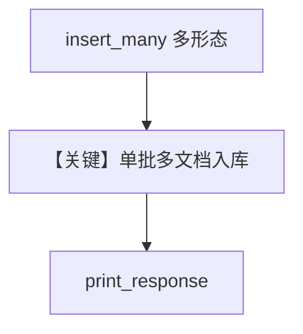

# from_multiple_sources.py — 实现原理分析

> 源文件：`cookbook/07_knowledge/09_archive/readers/from_multiple_sources.py`

## 概述

演示 **`insert_many`**：既支持 **字典列表**（path/url + metadata），也支持 **`urls=[...]`** 批量 URL；同步与异步各一套；异步 Knowledge 带 **`OpenAIEmbedder()`**。

**核心配置一览：**

| 配置项 | 值 | 说明 |
|--------|-----|------|
| `insert_many` | 多来源 | PDF + 文档站 |
| `ainsert_many` | 同上 + URL 列表 | |
| `create_async_agent` | `gpt-4o-mini` | 同步 Agent 默认 gpt-4o |

## 核心组件解析

### 多来源批处理

减少多次单独 `insert` 调用，统一元数据与跳过策略（若需要可扩展）。

## System Prompt 组装

同步 Agent 无显式 description；异步用 `gpt-4o-mini`；均含 knowledge 段。

## 完整 API 请求

分别默认 `gpt-4o` 与 `gpt-4o-mini`。

## Mermaid 流程图

## 关键源码文件索引

| 文件 | 作用 |
|------|------|
| `agno/knowledge/knowledge.py` | `insert_many`/`ainsert_many` |
