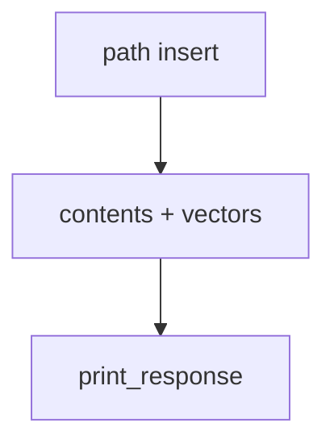

# from_path.py — 实现原理分析

<!-- cookbook-py-source:start -->
## 完整源码

```python
"""
From Path
=========

Demonstrates loading knowledge from a local file path using sync and async inserts.
"""

import asyncio

from agno.agent import Agent
from agno.db.postgres.postgres import PostgresDb
from agno.knowledge.knowledge import Knowledge
from agno.vectordb.pgvector import PgVector

# ---------------------------------------------------------------------------
# Setup
# ---------------------------------------------------------------------------
contents_db = PostgresDb(
    db_url="postgresql+psycopg://ai:ai@localhost:5532/ai",
    knowledge_table="knowledge_contents",
)

vector_db = PgVector(
    table_name="vectors",
    db_url="postgresql+psycopg://ai:ai@localhost:5532/ai",
)


# ---------------------------------------------------------------------------
# Create Knowledge Base
# ---------------------------------------------------------------------------
def create_sync_knowledge() -> Knowledge:
    return Knowledge(
        name="Basic SDK Knowledge Base",
        description="Agno 2.0 Knowledge Implementation",
        vector_db=vector_db,
        contents_db=contents_db,
    )


def create_async_knowledge() -> Knowledge:
    return Knowledge(
        name="Basic SDK Knowledge Base",
        description="Agno 2.0 Knowledge Implementation",
        vector_db=vector_db,
        contents_db=contents_db,
    )


# ---------------------------------------------------------------------------
# Create Agent
# ---------------------------------------------------------------------------
def create_agent(knowledge: Knowledge) -> Agent:
    return Agent(
        name="My Agent",
        description="Agno 2.0 Agent Implementation",
        knowledge=knowledge,
        search_knowledge=True,
        debug_mode=True,
    )


# ---------------------------------------------------------------------------
# Run Agent
# ---------------------------------------------------------------------------
def run_sync() -> None:
    knowledge = create_sync_knowledge()
    knowledge.insert(
        name="CV",
        path="cookbook/07_knowledge/testing_resources/cv_1.pdf",
        metadata={"user_tag": "Engineering Candidates"},
    )

    agent = create_agent(knowledge)
    agent.print_response(
        "What skills does Jordan Mitchell have?",
        markdown=True,
    )


async def run_async() -> None:
    knowledge = create_async_knowledge()
    await knowledge.ainsert(
        name="CV",
        path="cookbook/07_knowledge/testing_resources/cv_1.pdf",
        metadata={"user_tag": "Engineering Candidates"},
    )

    agent = create_agent(knowledge)
    agent.print_response(
        "What skills does Jordan Mitchell have?",
        markdown=True,
    )


if __name__ == "__main__":
    run_sync()
    asyncio.run(run_async())
```

<!-- cookbook-py-source:end -->

> 源文件：`cookbook/07_knowledge/09_archive/readers/from_path.py`

## 概述

本地 PDF **`insert`/`ainsert`**，带 **`PostgresDb` contents**；`Agent` 带 `name`/`description`/`debug_mode=True`。

**核心配置一览：**

| 配置项 | 值 | 说明 |
|--------|-----|------|
| `contents_db` + `PgVector` | 双库 | |
| `Agent` | 同上 | 默认模型 |

## 核心组件解析

标准路径入库 + 问答；强调 **sync/async 对称**。

## System Prompt 组装

含 `description`：`"Agno 2.0 Agent Implementation"`。

### 还原

```text
Agno 2.0 Agent Implementation

<knowledge_base>
You have a knowledge base you can search using the search_knowledge_base tool. Search before answering questions—don't assume you know the answer. For ambiguous questions, search first rather than asking for clarification.
</knowledge_base>
```

## 完整 API 请求

默认 `gpt-4o`。

## Mermaid 流程图



## 关键源码文件索引

| 文件 | 作用 |
|------|------|
| `agno/knowledge/knowledge.py` | `insert`/`ainsert` |
