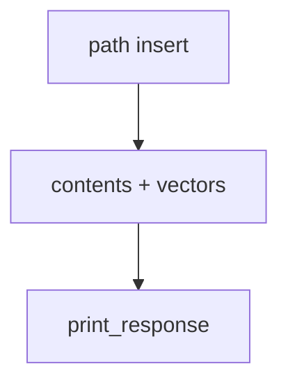

# from_path.py — 实现原理分析

> 源文件：`cookbook/07_knowledge/09_archive/readers/from_path.py`

## 概述

本地 PDF **`insert`/`ainsert`**，带 **`PostgresDb` contents**；`Agent` 带 `name`/`description`/`debug_mode=True`。

**核心配置一览：**

| 配置项 | 值 | 说明 |
|--------|-----|------|
| `contents_db` + `PgVector` | 双库 | |
| `Agent` | 同上 | 默认模型 |

## 核心组件解析

标准路径入库 + 问答；强调 **sync/async 对称**。

## System Prompt 组装

含 `description`：`"Agno 2.0 Agent Implementation"`。

### 还原

```text
Agno 2.0 Agent Implementation

<knowledge_base>
You have a knowledge base you can search using the search_knowledge_base tool. Search before answering questions—don't assume you know the answer. For ambiguous questions, search first rather than asking for clarification.
</knowledge_base>
```

## 完整 API 请求

默认 `gpt-4o`。

## Mermaid 流程图



## 关键源码文件索引

| 文件 | 作用 |
|------|------|
| `agno/knowledge/knowledge.py` | `insert`/`ainsert` |
