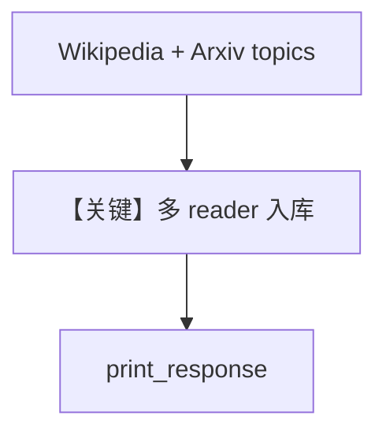

# from_topic.py — 实现原理分析

<!-- cookbook-py-source:start -->
## 完整源码

```python
"""
From Topic
==========

Demonstrates loading topics from Wikipedia and Arxiv using sync and async operations.
"""

import asyncio

from agno.agent import Agent
from agno.db.postgres import PostgresDb
from agno.knowledge.knowledge import Knowledge
from agno.knowledge.reader.arxiv_reader import ArxivReader
from agno.knowledge.reader.wikipedia_reader import WikipediaReader
from agno.vectordb.pgvector import PgVector

# ---------------------------------------------------------------------------
# Setup
# ---------------------------------------------------------------------------
vector_db = PgVector(
    table_name="vectors", db_url="postgresql+psycopg://ai:ai@localhost:5532/ai"
)
contents_db = PostgresDb(
    db_url="postgresql+psycopg://ai:ai@localhost:5532/ai",
    knowledge_table="knowledge_contents",
)


# ---------------------------------------------------------------------------
# Create Knowledge Base
# ---------------------------------------------------------------------------
def create_knowledge() -> Knowledge:
    return Knowledge(
        name="Basic SDK Knowledge Base",
        description="Agno 2.0 Knowledge Implementation",
        vector_db=vector_db,
        contents_db=contents_db,
    )


# ---------------------------------------------------------------------------
# Create Agent
# ---------------------------------------------------------------------------
def create_agent(knowledge: Knowledge) -> Agent:
    return Agent(
        name="My Agent",
        description="Agno 2.0 Agent Implementation",
        knowledge=knowledge,
        search_knowledge=True,
    )


# ---------------------------------------------------------------------------
# Run Agent
# ---------------------------------------------------------------------------
def run_sync() -> None:
    knowledge = create_knowledge()

    knowledge.insert(
        metadata={"user_tag": "Wikipedia content"},
        topics=["Manchester United"],
        reader=WikipediaReader(),
    )

    knowledge.insert(
        metadata={"user_tag": "Arxiv content"},
        topics=["Carbon Dioxide", "Oxygen"],
        reader=ArxivReader(),
    )

    knowledge.insert_many(
        topics=["Carbon Dioxide", "Nitrogen"],
        reader=ArxivReader(),
        skip_if_exists=True,
    )

    agent = create_agent(knowledge)
    agent.print_response(
        "What can you tell me about Manchester United?",
        markdown=True,
    )


async def run_async() -> None:
    knowledge = create_knowledge()

    await knowledge.ainsert(
        metadata={"user_tag": "Wikipedia content"},
        topics=["Manchester United"],
        reader=WikipediaReader(),
    )

    await knowledge.ainsert(
        metadata={"user_tag": "Arxiv content"},
        topics=["Carbon Dioxide", "Oxygen"],
        reader=ArxivReader(),
    )

    await knowledge.ainsert_many(
        topics=["Carbon Dioxide", "Nitrogen"],
        reader=ArxivReader(),
        skip_if_exists=True,
    )

    agent = create_agent(knowledge)
    agent.print_response(
        "What can you tell me about Manchester United?",
        markdown=True,
    )


if __name__ == "__main__":
    run_sync()
    asyncio.run(run_async())
```

<!-- cookbook-py-source:end -->

> 源文件：`cookbook/07_knowledge/09_archive/readers/from_topic.py`

## 概述

**`WikipediaReader`** 与 **`ArxivReader`** 按 **topics** 拉取；`insert_many` 演示 **topics 列表 + reader + skip_if_exists**。

**核心配置一览：**

| 配置项 | 值 | 说明 |
|--------|-----|------|
| `topics` | 曼联、CO2 等 | 多源主题 |
| `insert_many` | `skip_if_exists=True` | 幂等 |

## 核心组件解析

### 主题驱动 Reader

不同 Reader 对 `topics` 语义不同（百科 vs 论文检索）。

## System Prompt 组装

`description` + knowledge 块。

## 完整 API 请求

默认 `gpt-4o`。

## Mermaid 流程图



## 关键源码文件索引

| 文件 | 作用 |
|------|------|
| `agno/knowledge/reader/wikipedia_reader.py` | |
| `agno/knowledge/reader/arxiv_reader.py` | |
