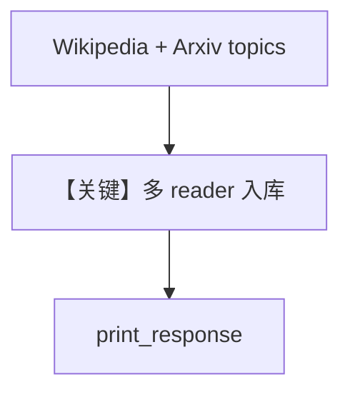

# from_topic.py — 实现原理分析

> 源文件：`cookbook/07_knowledge/09_archive/readers/from_topic.py`

## 概述

**`WikipediaReader`** 与 **`ArxivReader`** 按 **topics** 拉取；`insert_many` 演示 **topics 列表 + reader + skip_if_exists**。

**核心配置一览：**

| 配置项 | 值 | 说明 |
|--------|-----|------|
| `topics` | 曼联、CO2 等 | 多源主题 |
| `insert_many` | `skip_if_exists=True` | 幂等 |

## 核心组件解析

### 主题驱动 Reader

不同 Reader 对 `topics` 语义不同（百科 vs 论文检索）。

## System Prompt 组装

`description` + knowledge 块。

## 完整 API 请求

默认 `gpt-4o`。

## Mermaid 流程图

## 关键源码文件索引

| 文件 | 作用 |
|------|------|
| `agno/knowledge/reader/wikipedia_reader.py` | |
| `agno/knowledge/reader/arxiv_reader.py` | |
