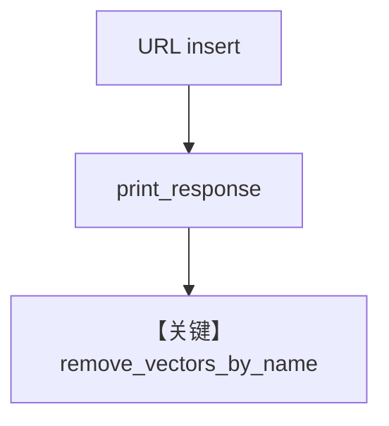

# from_url.py — 实现原理分析

> 源文件：`cookbook/07_knowledge/09_archive/readers/from_url.py`

## 概述

从 URL 拉取 **ThaiRecipes.pdf**，问答后 **`remove_vectors_by_name("Recipes")`** 清理向量，演示 **URL 入库 + 同步/异步 + 按名删向量**。

**核心配置一览：**

| 配置项 | 值 | 说明 |
|--------|-----|------|
| `remove_vectors_by_name` | 末尾调用 | 清理 |

## 核心组件解析

### 删除与重复运行

便于重复执行脚本时不无限堆积向量（仍需 contents 侧一致策略）。

## System Prompt 组装

`description` + knowledge 块。

## 完整 API 请求

默认 `gpt-4o`。

## Mermaid 流程图

## 关键源码文件索引

| 文件 | 作用 |
|------|------|
| `agno/knowledge/knowledge.py` | `remove_vectors_by_name` |
