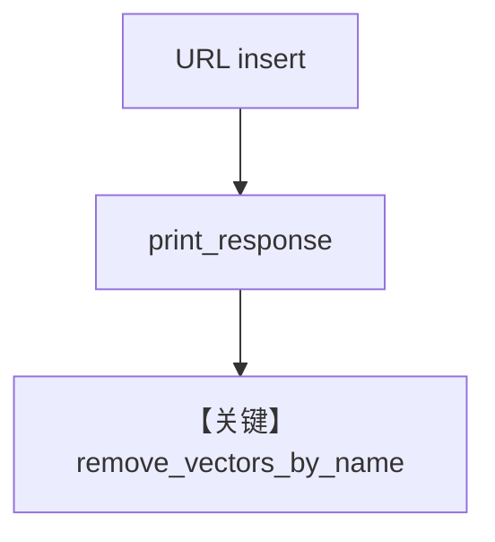

# from_url.py — 实现原理分析

<!-- cookbook-py-source:start -->
## 完整源码

```python
"""
From URL
========

Demonstrates loading knowledge from a URL using sync and async inserts.
"""

import asyncio

from agno.agent import Agent
from agno.db.postgres.postgres import PostgresDb
from agno.knowledge.knowledge import Knowledge
from agno.vectordb.pgvector import PgVector

# ---------------------------------------------------------------------------
# Setup
# ---------------------------------------------------------------------------
contents_db = PostgresDb(
    db_url="postgresql+psycopg://ai:ai@localhost:5532/ai",
    knowledge_table="knowledge_contents",
)


# ---------------------------------------------------------------------------
# Create Knowledge Base
# ---------------------------------------------------------------------------
def create_knowledge() -> Knowledge:
    return Knowledge(
        name="Basic SDK Knowledge Base",
        description="Agno 2.0 Knowledge Implementation",
        contents_db=contents_db,
        vector_db=PgVector(
            table_name="vectors", db_url="postgresql+psycopg://ai:ai@localhost:5532/ai"
        ),
    )


# ---------------------------------------------------------------------------
# Create Agent
# ---------------------------------------------------------------------------
def create_agent(knowledge: Knowledge) -> Agent:
    return Agent(
        name="My Agent",
        description="Agno 2.0 Agent Implementation",
        knowledge=knowledge,
        search_knowledge=True,
    )


# ---------------------------------------------------------------------------
# Run Agent
# ---------------------------------------------------------------------------
def run_sync() -> None:
    knowledge = create_knowledge()
    knowledge.insert(
        name="Recipes",
        url="https://agno-public.s3.amazonaws.com/recipes/ThaiRecipes.pdf",
        metadata={"user_tag": "Recipes from website"},
    )

    agent = create_agent(knowledge)
    agent.print_response(
        "What can you tell me about Thai recipes?",
        markdown=True,
    )
    knowledge.remove_vectors_by_name("Recipes")


async def run_async() -> None:
    knowledge = create_knowledge()
    await knowledge.ainsert(
        name="Recipes",
        url="https://agno-public.s3.amazonaws.com/recipes/ThaiRecipes.pdf",
        metadata={"user_tag": "Recipes from website"},
    )

    agent = create_agent(knowledge)
    agent.print_response(
        "What can you tell me about Thai recipes?",
        markdown=True,
    )
    knowledge.remove_vectors_by_name("Recipes")


if __name__ == "__main__":
    run_sync()
    asyncio.run(run_async())
```

<!-- cookbook-py-source:end -->

> 源文件：`cookbook/07_knowledge/09_archive/readers/from_url.py`

## 概述

从 URL 拉取 **ThaiRecipes.pdf**，问答后 **`remove_vectors_by_name("Recipes")`** 清理向量，演示 **URL 入库 + 同步/异步 + 按名删向量**。

**核心配置一览：**

| 配置项 | 值 | 说明 |
|--------|-----|------|
| `remove_vectors_by_name` | 末尾调用 | 清理 |

## 核心组件解析

### 删除与重复运行

便于重复执行脚本时不无限堆积向量（仍需 contents 侧一致策略）。

## System Prompt 组装

`description` + knowledge 块。

## 完整 API 请求

默认 `gpt-4o`。

## Mermaid 流程图



## 关键源码文件索引

| 文件 | 作用 |
|------|------|
| `agno/knowledge/knowledge.py` | `remove_vectors_by_name` |
